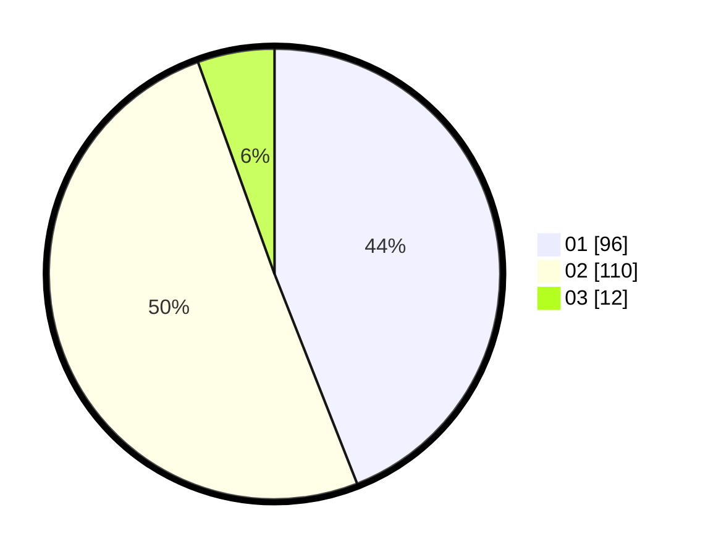

# Hasil

Hasil perolehan suara paslon dapat dilihat pada file paslon-01.txt, paslon-02.txt, dan paslon-03.txt.

Jika tidak ada, artinya data tersebut belum ada pada SIREKAP.

## Perolehan Suara

 * Paslon 01: **96**.
 * Paslon 02: **110**.
 * Paslon 03: **12**.

## Foto C Plano

https://sirekap-obj-formc.kpu.go.id/2e2a/pemilu/ppwp/31/73/01/10/06/3173011006142-20240214-201941--c6227da9-7246-47c9-a6d0-2f33b51f735f.jpg

https://sirekap-obj-formc.kpu.go.id/2e2a/pemilu/ppwp/31/73/01/10/06/3173011006142-20240215-015035--0711e788-d131-4c21-8655-3eb337be552b.jpg

https://sirekap-obj-formc.kpu.go.id/2e2a/pemilu/ppwp/31/73/01/10/06/3173011006142-20240214-202134--96f162ca-3c33-4827-bb68-824e3e7d5951.jpg

## DATA PEMILIH TETAP

Jumlah pemilih dalam DPT: **293**.
 * L: **144**.
 * P: **149**.

## DATA PENGGUNA HAK PILIH

Jumlah pengguna hak pilih dalam DPT: **223**.
 * L: **105**.
 * P: **115**.

Jumlah pengguna hak pilih dalam DPTb: **0**.
 * L: **0**.
 * P: **0**.

Jumlah pengguna hak pilih dalam DPK: **0**.
 * L: **0**.
 * P: **0**.

Jumlah pengguna hak pilih: **223**.
 * L: **108**.
 * P: **115**.

## JUMLAH SUARA SAH DAN TIDAK SAH

JUMLAH SELURUH SUARA SAH: **218**.

JUMLAH SUARA TIDAK SAH: **5**.

JUMLAH SELURUH SUARA SAH DAN SUARA TIDAK SAH: **223**.
