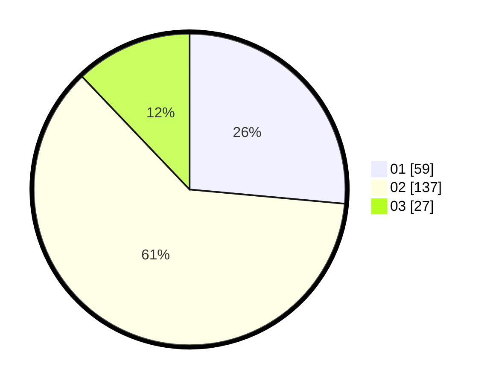

# Hasil

Hasil perolehan suara paslon dapat dilihat pada file paslon-01.txt, paslon-02.txt, dan paslon-03.txt.

Jika tidak ada, artinya data tersebut belum ada pada SIREKAP.

## Perolehan Suara

 * Paslon 01: **59**.
 * Paslon 02: **137**.
 * Paslon 03: **27**.

## Foto C Plano

https://sirekap-obj-formc.kpu.go.id/7c0d/pemilu/ppwp/31/73/01/10/06/3173011006145-20240215-002217--f3ebeb82-11f5-4e22-8386-6b804f7c87eb.jpg

https://sirekap-obj-formc.kpu.go.id/7c0d/pemilu/ppwp/31/73/01/10/06/3173011006145-20240215-000745--73491926-8fad-4452-b6af-deb838e0a811.jpg

https://sirekap-obj-formc.kpu.go.id/7c0d/pemilu/ppwp/31/73/01/10/06/3173011006145-20240215-001953--42f699e2-d720-430a-9a52-e2967e9963bd.jpg
