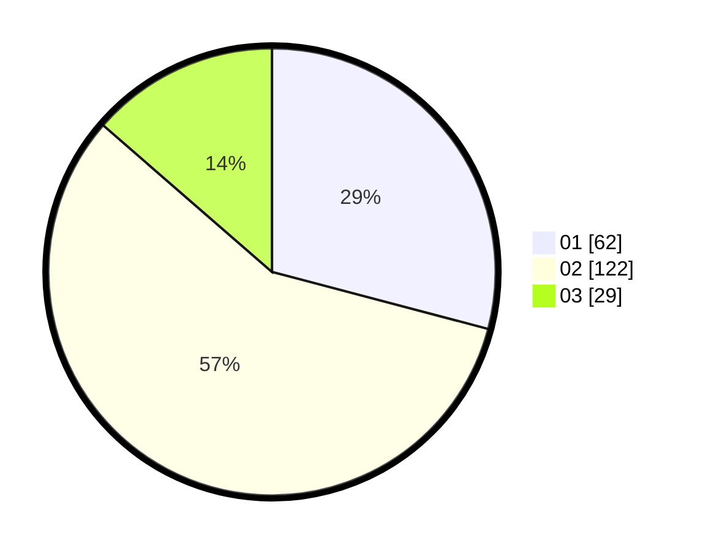

# Hasil

Hasil perolehan suara paslon dapat dilihat pada file paslon-01.txt, paslon-02.txt, dan paslon-03.txt.

Jika tidak ada, artinya data tersebut belum ada pada SIREKAP.

## Perolehan Suara

 * Paslon 01: **62**.
 * Paslon 02: **122**.
 * Paslon 03: **29**.

## Foto C Plano

https://sirekap-obj-formc.kpu.go.id/18c5/pemilu/ppwp/31/73/01/10/06/3173011006146-20240216-142803--f2cb5a71-b7d5-45e8-8e25-45ff9ab73845.jpg

https://sirekap-obj-formc.kpu.go.id/18c5/pemilu/ppwp/31/73/01/10/06/3173011006146-20240216-142804--10549317-99b8-4ed0-95f7-23559e46a8ea.jpg

https://sirekap-obj-formc.kpu.go.id/18c5/pemilu/ppwp/31/73/01/10/06/3173011006146-20240216-142804--a378926e-7c52-441a-a821-c4d01546c46c.jpg

## DATA PEMILIH TETAP

Jumlah pemilih dalam DPT: **290**.
 * L: **155**.
 * P: **135**.

## DATA PENGGUNA HAK PILIH

Jumlah pengguna hak pilih dalam DPT: **213**.
 * L: **111**.
 * P: **102**.

Jumlah pengguna hak pilih dalam DPTb: **2**.
 * L: **1**.
 * P: **1**.

Jumlah pengguna hak pilih dalam DPK: **2**.
 * L: **0**.
 * P: **2**.

Jumlah pengguna hak pilih: **217**.
 * L: **112**.
 * P: **105**.

## JUMLAH SUARA SAH DAN TIDAK SAH

JUMLAH SELURUH SUARA SAH: **213**.

JUMLAH SUARA TIDAK SAH: **4**.

JUMLAH SELURUH SUARA SAH DAN SUARA TIDAK SAH: **217**.
