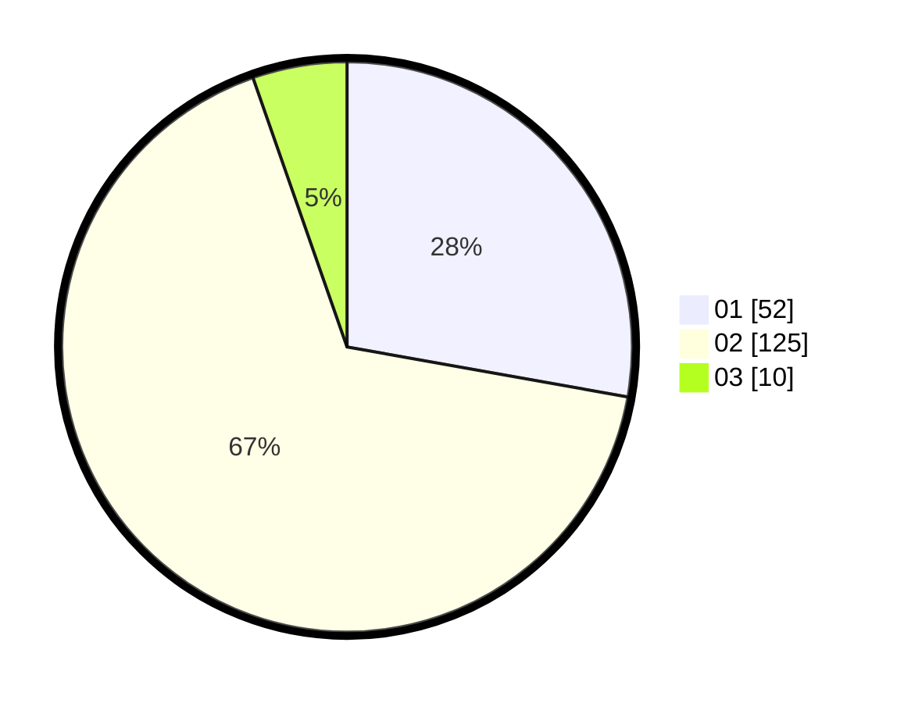

# Hasil

Hasil perolehan suara paslon dapat dilihat pada file paslon-01.txt, paslon-02.txt, dan paslon-03.txt.

Jika tidak ada, artinya data tersebut belum ada pada SIREKAP.

## Perolehan Suara

 * Paslon 01: **52**.
 * Paslon 02: **125**.
 * Paslon 03: **10**.

## Foto C Plano

https://sirekap-obj-formc.kpu.go.id/456d/pemilu/ppwp/31/73/01/10/06/3173011006147-20240215-002245--9256dbc8-8503-4aef-898b-5ac0911314ae.jpg

https://sirekap-obj-formc.kpu.go.id/456d/pemilu/ppwp/31/73/01/10/06/3173011006147-20240215-002318--b92a28a0-94a9-4b16-8c06-6f5505febcc4.jpg

https://sirekap-obj-formc.kpu.go.id/456d/pemilu/ppwp/31/73/01/10/06/3173011006147-20240215-002326--ad6ec78d-7845-43ca-814c-11d5e3780dc8.jpg

## DATA PEMILIH TETAP

Jumlah pemilih dalam DPT: **245**.
 * L: **121**.
 * P: **124**.

## DATA PENGGUNA HAK PILIH

Jumlah pengguna hak pilih dalam DPT: **187**.
 * L: **89**.
 * P: **98**.

Jumlah pengguna hak pilih dalam DPTb: **3**.
 * L: **2**.
 * P: **1**.

Jumlah pengguna hak pilih dalam DPK: **0**.
 * L: **0**.
 * P: **0**.

Jumlah pengguna hak pilih: **190**.
 * L: **91**.
 * P: **99**.

## JUMLAH SUARA SAH DAN TIDAK SAH

JUMLAH SELURUH SUARA SAH: **187**.

JUMLAH SUARA TIDAK SAH: **3**.

JUMLAH SELURUH SUARA SAH DAN SUARA TIDAK SAH: **190**.
