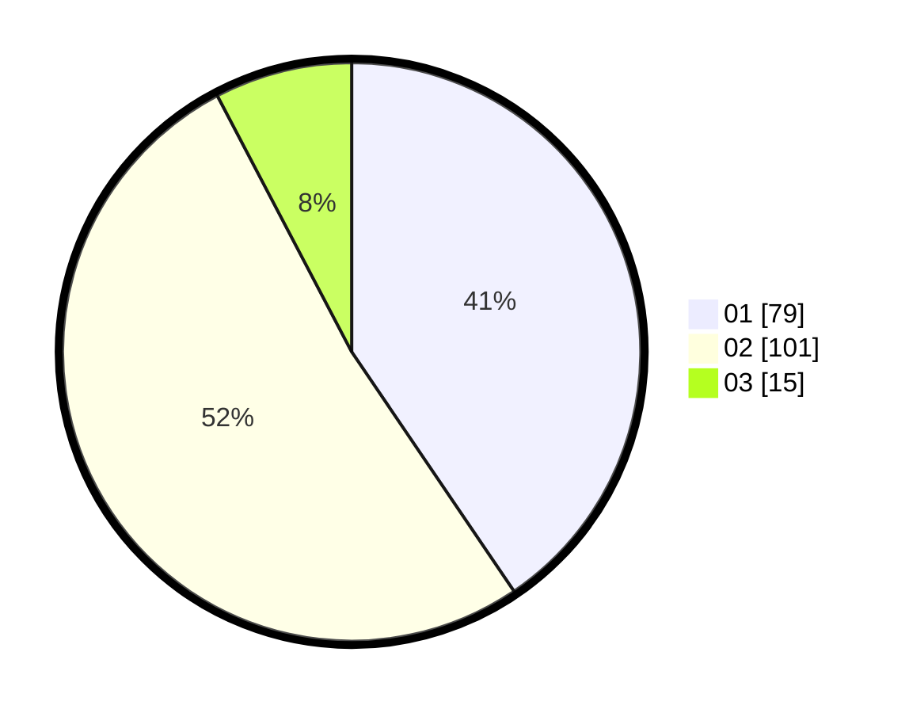

# Hasil

Hasil perolehan suara paslon dapat dilihat pada file paslon-01.txt, paslon-02.txt, dan paslon-03.txt.

Jika tidak ada, artinya data tersebut belum ada pada SIREKAP.

## Perolehan Suara

 * Paslon 01: **79**.
 * Paslon 02: **101**.
 * Paslon 03: **15**.

## Foto C Plano

https://sirekap-obj-formc.kpu.go.id/9279/pemilu/ppwp/31/73/01/10/06/3173011006152-20240216-131246--f92fb755-18fd-43f0-854f-e90cc0e71c48.jpg

https://sirekap-obj-formc.kpu.go.id/9279/pemilu/ppwp/31/73/01/10/06/3173011006152-20240216-131248--99d8aeb8-e06c-467c-ac10-86a04f88d101.jpg

https://sirekap-obj-formc.kpu.go.id/9279/pemilu/ppwp/31/73/01/10/06/3173011006152-20240216-131247--5d79def1-2249-4900-a184-92eadcedc93c.jpg

## DATA PEMILIH TETAP

Jumlah pemilih dalam DPT: **281**.
 * L: **129**.
 * P: **152**.

## DATA PENGGUNA HAK PILIH

Jumlah pengguna hak pilih dalam DPT: **198**.
 * L: **82**.
 * P: **116**.

Jumlah pengguna hak pilih dalam DPTb: **0**.
 * L: **0**.
 * P: **0**.

Jumlah pengguna hak pilih dalam DPK: **0**.
 * L: **0**.
 * P: **0**.

Jumlah pengguna hak pilih: **198**.
 * L: **82**.
 * P: **116**.

## JUMLAH SUARA SAH DAN TIDAK SAH

JUMLAH SELURUH SUARA SAH: **195**.

JUMLAH SUARA TIDAK SAH: **3**.

JUMLAH SELURUH SUARA SAH DAN SUARA TIDAK SAH: **198**.
