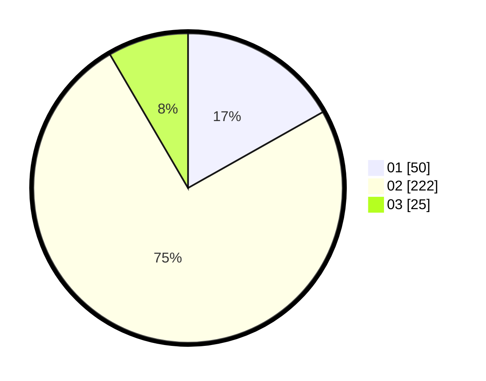

# Hasil

Hasil perolehan suara paslon dapat dilihat pada file paslon-01.txt, paslon-02.txt, dan paslon-03.txt.

Jika tidak ada, artinya data tersebut belum ada pada SIREKAP.

## Perolehan Suara

 * Paslon 01: **50**.
 * Paslon 02: **222**.
 * Paslon 03: **25**.

## Foto C Plano

https://sirekap-obj-formc.kpu.go.id/c9ee/pemilu/ppwp/31/73/01/10/06/3173011006157-20240215-201124--33ae41c1-a43d-4501-a4af-9de095935a51.jpg

https://sirekap-obj-formc.kpu.go.id/c9ee/pemilu/ppwp/31/73/01/10/06/3173011006157-20240214-190213--44c3d16e-62a6-4269-9c16-537faf19d99a.jpg

https://sirekap-obj-formc.kpu.go.id/c9ee/pemilu/ppwp/31/73/01/10/06/3173011006157-20240215-201139--0735298e-0673-474c-96fd-7d9e0ba02e67.jpg

## DATA PEMILIH TETAP

Jumlah pemilih dalam DPT: **240**.
 * L: **127**.
 * P: **113**.

## DATA PENGGUNA HAK PILIH

Jumlah pengguna hak pilih dalam DPT: **191**.
 * L: **97**.
 * P: **94**.

Jumlah pengguna hak pilih dalam DPTb: **0**.
 * L: **0**.
 * P: **0**.

Jumlah pengguna hak pilih dalam DPK: **0**.
 * L: **0**.
 * P: **0**.

Jumlah pengguna hak pilih: **191**.
 * L: **97**.
 * P: **94**.

## JUMLAH SUARA SAH DAN TIDAK SAH

JUMLAH SELURUH SUARA SAH: **187**.

JUMLAH SUARA TIDAK SAH: **4**.

JUMLAH SELURUH SUARA SAH DAN SUARA TIDAK SAH: **191**.
