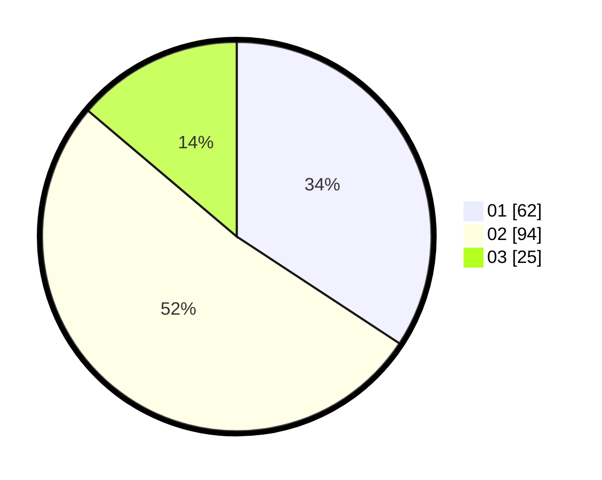

# Hasil

Hasil perolehan suara paslon dapat dilihat pada file paslon-01.txt, paslon-02.txt, dan paslon-03.txt.

Jika tidak ada, artinya data tersebut belum ada pada SIREKAP.

## Perolehan Suara

 * Paslon 01: **62**.
 * Paslon 02: **94**.
 * Paslon 03: **25**.

## Foto C Plano

https://sirekap-obj-formc.kpu.go.id/293f/pemilu/ppwp/31/73/01/10/06/3173011006162-20240215-011033--606f851b-5a74-4519-b7a5-552da226b073.jpg

https://sirekap-obj-formc.kpu.go.id/293f/pemilu/ppwp/31/73/01/10/06/3173011006162-20240215-011118--c351f92b-c0d9-445a-a166-df03ac62b8f5.jpg

https://sirekap-obj-formc.kpu.go.id/293f/pemilu/ppwp/31/73/01/10/06/3173011006162-20240215-011153--f4794f07-f66b-4dc3-851f-ebd266e107da.jpg

## DATA PEMILIH TETAP

Jumlah pemilih dalam DPT: **240**.
 * L: **116**.
 * P: **124**.

## DATA PENGGUNA HAK PILIH

Jumlah pengguna hak pilih dalam DPT: **183**.
 * L: **88**.
 * P: **95**.

Jumlah pengguna hak pilih dalam DPTb: **0**.
 * L: **0**.
 * P: **0**.

Jumlah pengguna hak pilih dalam DPK: **0**.
 * L: **0**.
 * P: **0**.

Jumlah pengguna hak pilih: **183**.
 * L: **88**.
 * P: **95**.

## JUMLAH SUARA SAH DAN TIDAK SAH

JUMLAH SELURUH SUARA SAH: **181**.

JUMLAH SUARA TIDAK SAH: **2**.

JUMLAH SELURUH SUARA SAH DAN SUARA TIDAK SAH: **183**.
