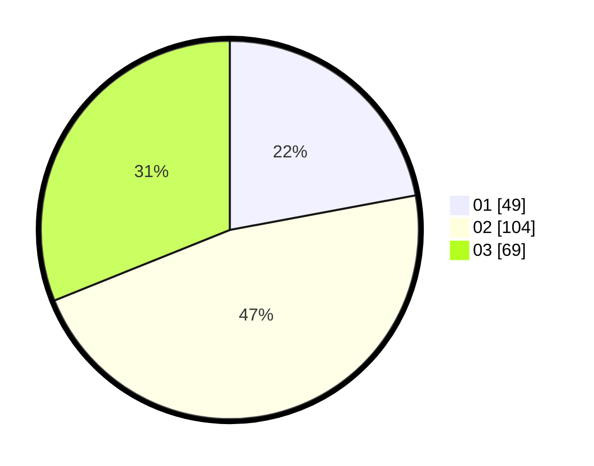

# Hasil

Hasil perolehan suara paslon dapat dilihat pada file paslon-01.txt, paslon-02.txt, dan paslon-03.txt.

Jika tidak ada, artinya data tersebut belum ada pada SIREKAP.

## Perolehan Suara

 * Paslon 01: **49**.
 * Paslon 02: **104**.
 * Paslon 03: **69**.

## Foto C Plano

https://sirekap-obj-formc.kpu.go.id/0e7c/pemilu/ppwp/31/73/01/10/06/3173011006163-20240214-232339--e21774e8-63fe-4a5a-b377-ecca339447ae.jpg

https://sirekap-obj-formc.kpu.go.id/0e7c/pemilu/ppwp/31/73/01/10/06/3173011006163-20240214-232517--948e2751-3e0c-415d-8064-e6bbbf241842.jpg

https://sirekap-obj-formc.kpu.go.id/0e7c/pemilu/ppwp/31/73/01/10/06/3173011006163-20240214-232627--8b407fb1-fed3-4643-8ff0-767e30abe094.jpg
