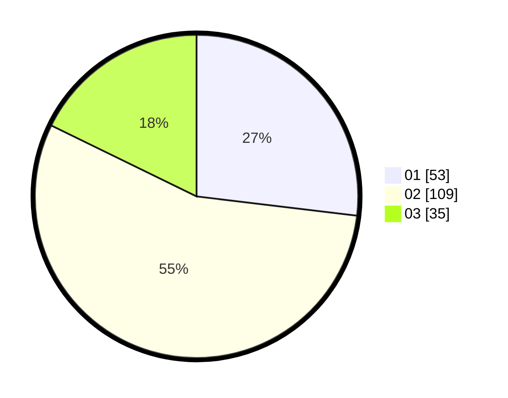

# Hasil

Hasil perolehan suara paslon dapat dilihat pada file paslon-01.txt, paslon-02.txt, dan paslon-03.txt.

Jika tidak ada, artinya data tersebut belum ada pada SIREKAP.

## Perolehan Suara

 * Paslon 01: **53**.
 * Paslon 02: **109**.
 * Paslon 03: **35**.

## Foto C Plano

https://sirekap-obj-formc.kpu.go.id/e080/pemilu/ppwp/31/73/01/10/06/3173011006167-20240214-234235--4149300c-054a-4828-838e-4167af2657d4.jpg

https://sirekap-obj-formc.kpu.go.id/e080/pemilu/ppwp/31/73/01/10/06/3173011006167-20240214-235155--f3ffaefe-68f6-4947-b035-6b2d77b89274.jpg

https://sirekap-obj-formc.kpu.go.id/e080/pemilu/ppwp/31/73/01/10/06/3173011006167-20240214-235113--cd5ca562-85d5-4b92-86e4-ad943bcde23a.jpg
