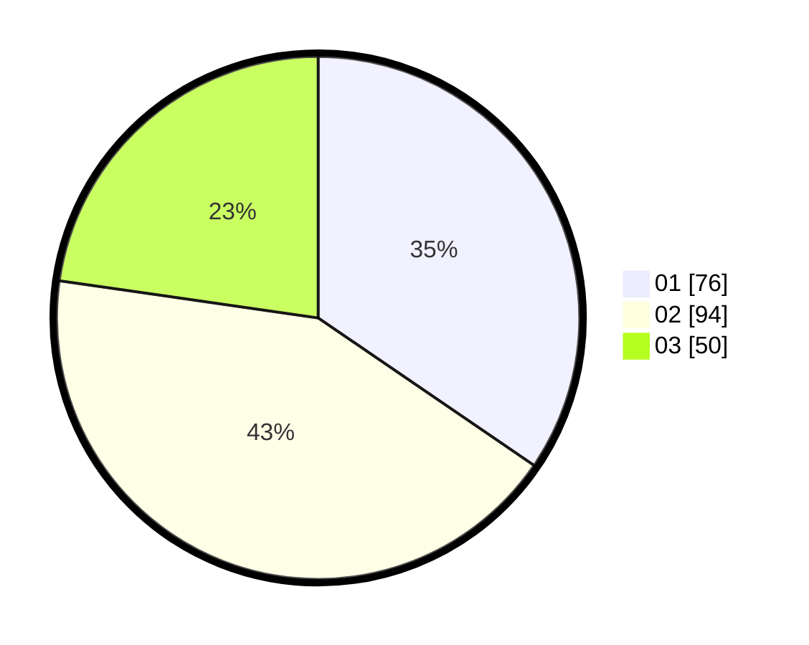

# Hasil

Hasil perolehan suara paslon dapat dilihat pada file paslon-01.txt, paslon-02.txt, dan paslon-03.txt.

Jika tidak ada, artinya data tersebut belum ada pada SIREKAP.

## Perolehan Suara

 * Paslon 01: **76**.
 * Paslon 02: **94**.
 * Paslon 03: **50**.

## Foto C Plano

https://sirekap-obj-formc.kpu.go.id/466f/pemilu/ppwp/31/73/01/10/06/3173011006173-20240214-213842--4a5548a8-6f56-40db-a1d7-f25a342ab732.jpg

https://sirekap-obj-formc.kpu.go.id/466f/pemilu/ppwp/31/73/01/10/06/3173011006173-20240214-213904--600db193-97cc-436f-a98b-5c4cb085fd14.jpg

https://sirekap-obj-formc.kpu.go.id/466f/pemilu/ppwp/31/73/01/10/06/3173011006173-20240214-213853--cf0a9101-c155-4c94-8805-f1088fa88c96.jpg

## DATA PEMILIH TETAP

Jumlah pemilih dalam DPT: **222**.
 * L: **107**.
 * P: **115**.

## DATA PENGGUNA HAK PILIH

Jumlah pengguna hak pilih dalam DPT: **222**.
 * L: **107**.
 * P: **115**.

Jumlah pengguna hak pilih dalam DPTb: **0**.
 * L: **0**.
 * P: **0**.

Jumlah pengguna hak pilih dalam DPK: **4**.
 * L: **3**.
 * P: **1**.

Jumlah pengguna hak pilih: **226**.
 * L: **110**.
 * P: **116**.

## JUMLAH SUARA SAH DAN TIDAK SAH

JUMLAH SELURUH SUARA SAH: **220**.

JUMLAH SUARA TIDAK SAH: **6**.

JUMLAH SELURUH SUARA SAH DAN SUARA TIDAK SAH: **226**.
