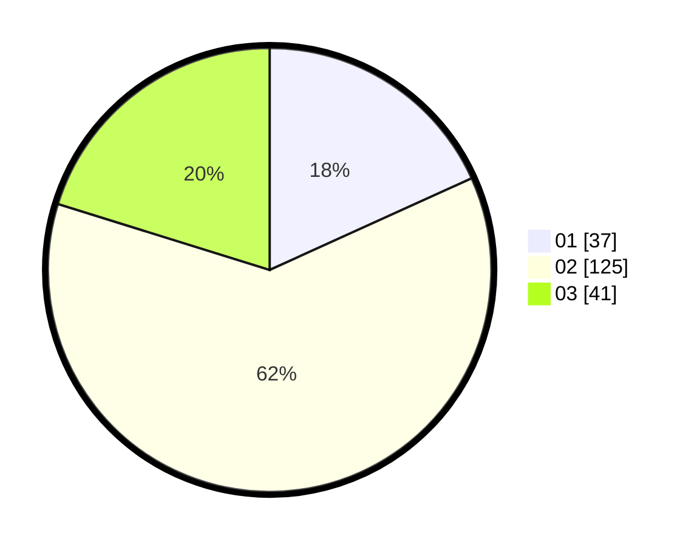

# Hasil

Hasil perolehan suara paslon dapat dilihat pada file paslon-01.txt, paslon-02.txt, dan paslon-03.txt.

Jika tidak ada, artinya data tersebut belum ada pada SIREKAP.

## Perolehan Suara

 * Paslon 01: **37**.
 * Paslon 02: **125**.
 * Paslon 03: **41**.

## Foto C Plano

https://sirekap-obj-formc.kpu.go.id/7df5/pemilu/ppwp/31/73/01/10/06/3173011006175-20240215-055311--062606af-c333-432d-9b95-cdb3e8856018.jpg

https://sirekap-obj-formc.kpu.go.id/7df5/pemilu/ppwp/31/73/01/10/06/3173011006175-20240216-004509--de84e3a5-defa-4370-8258-58963d09e424.jpg

https://sirekap-obj-formc.kpu.go.id/7df5/pemilu/ppwp/31/73/01/10/06/3173011006175-20240215-055321--2e1e960f-9021-4b80-bc4c-47a7e48d0a43.jpg

## DATA PEMILIH TETAP

Jumlah pemilih dalam DPT: **283**.
 * L: **145**.
 * P: **138**.

## DATA PENGGUNA HAK PILIH

Jumlah pengguna hak pilih dalam DPT: **200**.
 * L: **96**.
 * P: **104**.

Jumlah pengguna hak pilih dalam DPTb: **3**.
 * L: **2**.
 * P: **1**.

Jumlah pengguna hak pilih dalam DPK: **4**.
 * L: **1**.
 * P: **3**.

Jumlah pengguna hak pilih: **207**.
 * L: **99**.
 * P: **108**.

## JUMLAH SUARA SAH DAN TIDAK SAH

JUMLAH SELURUH SUARA SAH: **203**.

JUMLAH SUARA TIDAK SAH: **4**.

JUMLAH SELURUH SUARA SAH DAN SUARA TIDAK SAH: **207**.
