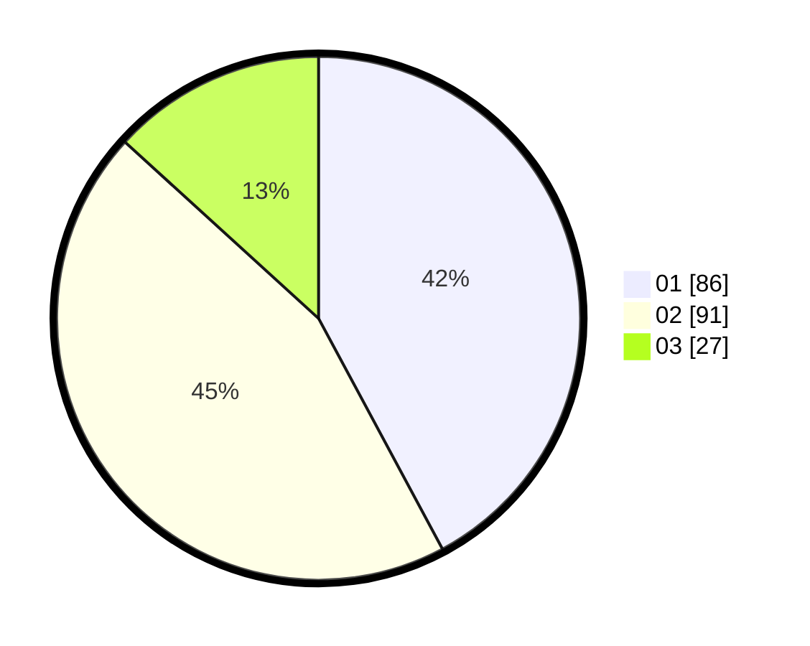

# Hasil

Hasil perolehan suara paslon dapat dilihat pada file paslon-01.txt, paslon-02.txt, dan paslon-03.txt.

Jika tidak ada, artinya data tersebut belum ada pada SIREKAP.

## Perolehan Suara

 * Paslon 01: **86**.
 * Paslon 02: **91**.
 * Paslon 03: **27**.

## Foto C Plano

https://sirekap-obj-formc.kpu.go.id/625c/pemilu/ppwp/31/73/01/10/06/3173011006190-20240216-015102--efa7380f-4c39-436e-812d-e94cc3dda1a5.jpg

https://sirekap-obj-formc.kpu.go.id/625c/pemilu/ppwp/31/73/01/10/06/3173011006190-20240216-015121--00618c07-c332-4fc5-9fa7-ea8b39912d3f.jpg

https://sirekap-obj-formc.kpu.go.id/625c/pemilu/ppwp/31/73/01/10/06/3173011006190-20240216-015112--8f90e52c-efae-419f-b05a-2d2a8e7b8981.jpg

## DATA PEMILIH TETAP

Jumlah pemilih dalam DPT: **240**.
 * L: **117**.
 * P: **123**.

## DATA PENGGUNA HAK PILIH

Jumlah pengguna hak pilih dalam DPT: **197**.
 * L: **94**.
 * P: **103**.

Jumlah pengguna hak pilih dalam DPTb: **0**.
 * L: **9**.
 * P: **0**.

Jumlah pengguna hak pilih dalam DPK: **0**.
 * L: **0**.
 * P: **0**.

Jumlah pengguna hak pilih: **0**.
 * L: **0**.
 * P: **0**.

## JUMLAH SUARA SAH DAN TIDAK SAH

JUMLAH SELURUH SUARA SAH: **204**.

JUMLAH SUARA TIDAK SAH: **2**.

JUMLAH SELURUH SUARA SAH DAN SUARA TIDAK SAH: **2**.
