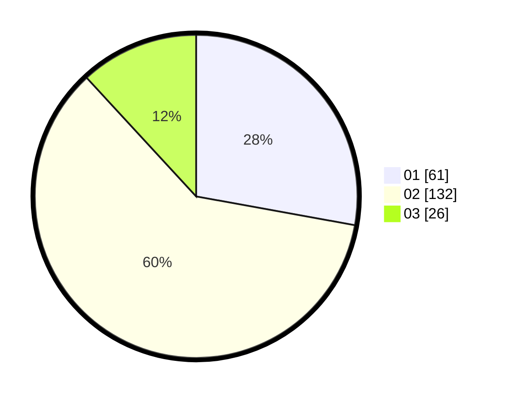

# Hasil

Hasil perolehan suara paslon dapat dilihat pada file paslon-01.txt, paslon-02.txt, dan paslon-03.txt.

Jika tidak ada, artinya data tersebut belum ada pada SIREKAP.

## Perolehan Suara

 * Paslon 01: **61**.
 * Paslon 02: **132**.
 * Paslon 03: **26**.

## Foto C Plano

https://sirekap-obj-formc.kpu.go.id/c846/pemilu/ppwp/31/73/01/10/06/3173011006192-20240214-194929--41efc79a-fcf3-4b7d-a7e5-716430460b70.jpg

https://sirekap-obj-formc.kpu.go.id/c846/pemilu/ppwp/31/73/01/10/06/3173011006192-20240214-195022--a3a99d8b-1c82-4765-810c-7de2859c8370.jpg

https://sirekap-obj-formc.kpu.go.id/c846/pemilu/ppwp/31/73/01/10/06/3173011006192-20240214-205833--79ee9f7e-19dc-43cd-81c8-ec211e0de3fb.jpg

## DATA PEMILIH TETAP

Jumlah pemilih dalam DPT: **273**.
 * L: **126**.
 * P: **147**.

## DATA PENGGUNA HAK PILIH

Jumlah pengguna hak pilih dalam DPT: **221**.
 * L: **98**.
 * P: **123**.

Jumlah pengguna hak pilih dalam DPTb: **0**.
 * L: **0**.
 * P: **0**.

Jumlah pengguna hak pilih dalam DPK: **1**.
 * L: **0**.
 * P: **1**.

Jumlah pengguna hak pilih: **222**.
 * L: **98**.
 * P: **124**.

## JUMLAH SUARA SAH DAN TIDAK SAH

JUMLAH SELURUH SUARA SAH: **219**.

JUMLAH SUARA TIDAK SAH: **3**.

JUMLAH SELURUH SUARA SAH DAN SUARA TIDAK SAH: **222**.
