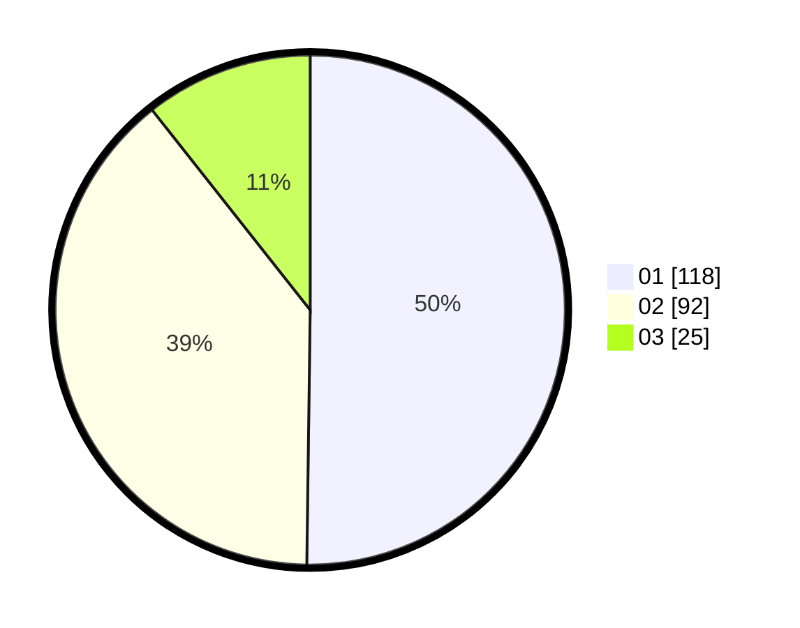

# Hasil

Hasil perolehan suara paslon dapat dilihat pada file paslon-01.txt, paslon-02.txt, dan paslon-03.txt.

Jika tidak ada, artinya data tersebut belum ada pada SIREKAP.

## Perolehan Suara

 * Paslon 01: **118**.
 * Paslon 02: **92**.
 * Paslon 03: **25**.

## Foto C Plano

https://sirekap-obj-formc.kpu.go.id/57a3/pemilu/ppwp/31/73/01/10/06/3173011006194-20240214-231719--3da92c4c-d918-4bd0-b1a5-3f72968e6381.jpg

https://sirekap-obj-formc.kpu.go.id/57a3/pemilu/ppwp/31/73/01/10/06/3173011006194-20240214-231906--e703c066-f5df-4e24-b4bf-377d90932734.jpg

https://sirekap-obj-formc.kpu.go.id/57a3/pemilu/ppwp/31/73/01/10/06/3173011006194-20240214-232034--ac782992-76f4-4c22-baca-f62dc20c7eae.jpg
