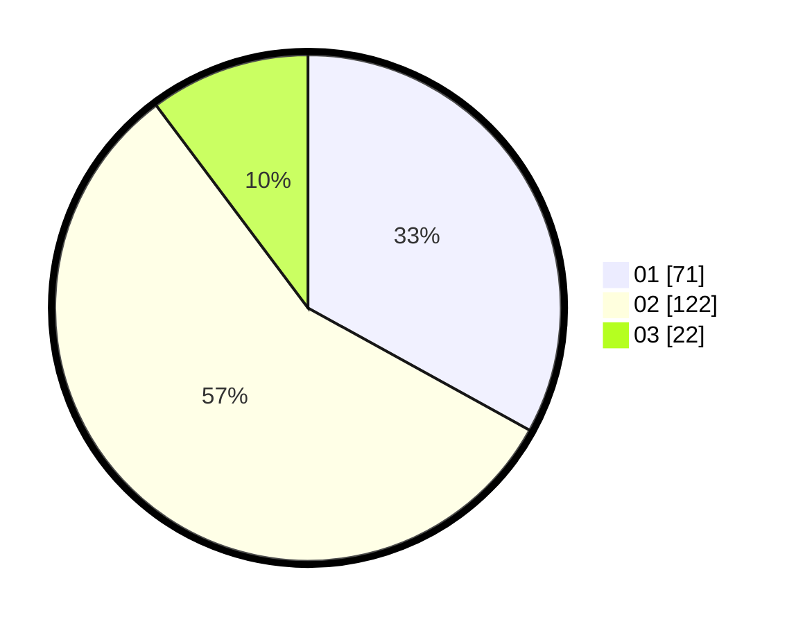

# Hasil

Hasil perolehan suara paslon dapat dilihat pada file paslon-01.txt, paslon-02.txt, dan paslon-03.txt.

Jika tidak ada, artinya data tersebut belum ada pada SIREKAP.

## Perolehan Suara

 * Paslon 01: **71**.
 * Paslon 02: **122**.
 * Paslon 03: **22**.

## Foto C Plano

https://sirekap-obj-formc.kpu.go.id/ed1b/pemilu/ppwp/31/73/01/10/06/3173011006196-20240214-224052--36c76cdf-d9ef-4ee9-b341-aef6b356b26e.jpg

https://sirekap-obj-formc.kpu.go.id/ed1b/pemilu/ppwp/31/73/01/10/06/3173011006196-20240214-224101--d259add4-7e79-4d91-88f8-925ee3e847b9.jpg

https://sirekap-obj-formc.kpu.go.id/ed1b/pemilu/ppwp/31/73/01/10/06/3173011006196-20240214-224135--c81611f7-3fc3-4d0e-abfc-a2750a9afa32.jpg

## DATA PEMILIH TETAP

Jumlah pemilih dalam DPT: **282**.
 * L: **141**.
 * P: **141**.

## DATA PENGGUNA HAK PILIH

Jumlah pengguna hak pilih dalam DPT: **223**.
 * L: **103**.
 * P: **120**.

Jumlah pengguna hak pilih dalam DPTb: **0**.
 * L: **0**.
 * P: **0**.

Jumlah pengguna hak pilih dalam DPK: **0**.
 * L: **0**.
 * P: **0**.

Jumlah pengguna hak pilih: **223**.
 * L: **103**.
 * P: **120**.

## JUMLAH SUARA SAH DAN TIDAK SAH

JUMLAH SELURUH SUARA SAH: **216**.

JUMLAH SUARA TIDAK SAH: **7**.

JUMLAH SELURUH SUARA SAH DAN SUARA TIDAK SAH: **223**.
