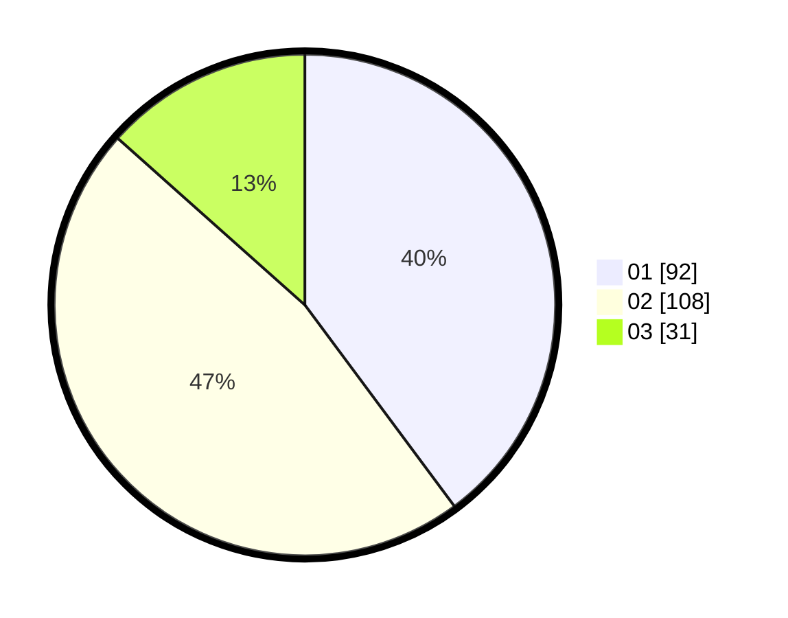

# Hasil

Hasil perolehan suara paslon dapat dilihat pada file paslon-01.txt, paslon-02.txt, dan paslon-03.txt.

Jika tidak ada, artinya data tersebut belum ada pada SIREKAP.

## Perolehan Suara

 * Paslon 01: **92**.
 * Paslon 02: **108**.
 * Paslon 03: **31**.

## Foto C Plano

https://sirekap-obj-formc.kpu.go.id/25be/pemilu/ppwp/31/73/01/10/06/3173011006201-20240215-104313--d617ebcc-d04e-4dfa-add6-e2ecb946f1f7.jpg

https://sirekap-obj-formc.kpu.go.id/25be/pemilu/ppwp/31/73/01/10/06/3173011006201-20240215-104334--d56b82c5-b782-418f-88a0-90460d1d1175.jpg

https://sirekap-obj-formc.kpu.go.id/25be/pemilu/ppwp/31/73/01/10/06/3173011006201-20240215-104324--5ad92a92-9cb9-4868-8a06-0cd6caf4654f.jpg

## DATA PEMILIH TETAP

Jumlah pemilih dalam DPT: **286**.
 * L: **141**.
 * P: **145**.

## DATA PENGGUNA HAK PILIH

Jumlah pengguna hak pilih dalam DPT: **230**.
 * L: **114**.
 * P: **116**.

Jumlah pengguna hak pilih dalam DPTb: **2**.
 * L: **0**.
 * P: **2**.

Jumlah pengguna hak pilih dalam DPK: **0**.
 * L: **0**.
 * P: **0**.

Jumlah pengguna hak pilih: **232**.
 * L: **114**.
 * P: **118**.

## JUMLAH SUARA SAH DAN TIDAK SAH

JUMLAH SELURUH SUARA SAH: **231**.

JUMLAH SUARA TIDAK SAH: **1**.

JUMLAH SELURUH SUARA SAH DAN SUARA TIDAK SAH: **232**.
