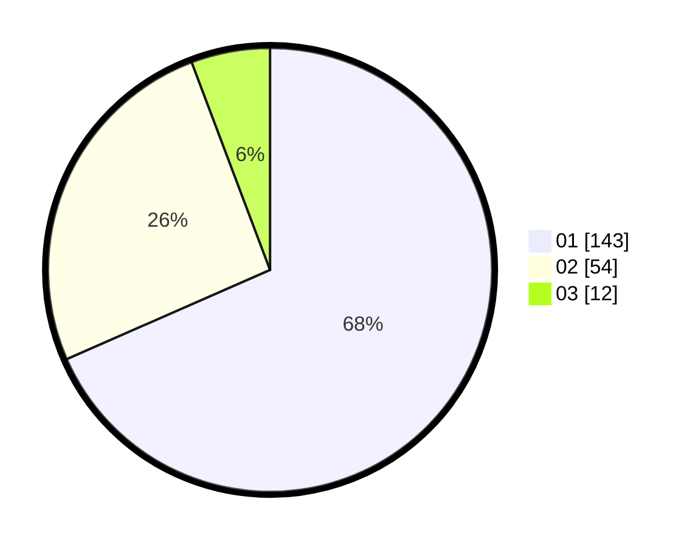

# Hasil

Hasil perolehan suara paslon dapat dilihat pada file paslon-01.txt, paslon-02.txt, dan paslon-03.txt.

Jika tidak ada, artinya data tersebut belum ada pada SIREKAP.

## Perolehan Suara

 * Paslon 01: **143**.
 * Paslon 02: **54**.
 * Paslon 03: **12**.

## Foto C Plano

https://sirekap-obj-formc.kpu.go.id/2af4/pemilu/ppwp/31/73/01/10/06/3173011006205-20240216-033714--ee3be0c5-d45e-4396-96ae-df2cbbb36c0b.jpg

https://sirekap-obj-formc.kpu.go.id/2af4/pemilu/ppwp/31/73/01/10/06/3173011006205-20240216-033719--b7f2e58e-b6ea-4ccb-b51b-2c085a2bd1d6.jpg

https://sirekap-obj-formc.kpu.go.id/2af4/pemilu/ppwp/31/73/01/10/06/3173011006205-20240216-033716--481a0e0d-043a-4bac-b8f9-1011a47b7f05.jpg

## DATA PEMILIH TETAP

Jumlah pemilih dalam DPT: **259**.
 * L: **138**.
 * P: **121**.

## DATA PENGGUNA HAK PILIH

Jumlah pengguna hak pilih dalam DPT: **195**.
 * L: **95**.
 * P: **100**.

Jumlah pengguna hak pilih dalam DPTb: **13**.
 * L: **13**.
 * P: **0**.

Jumlah pengguna hak pilih dalam DPK: **2**.
 * L: **1**.
 * P: **1**.

Jumlah pengguna hak pilih: **210**.
 * L: **109**.
 * P: **101**.

## JUMLAH SUARA SAH DAN TIDAK SAH

JUMLAH SELURUH SUARA SAH: **209**.

JUMLAH SUARA TIDAK SAH: **1**.

JUMLAH SELURUH SUARA SAH DAN SUARA TIDAK SAH: **210**.
