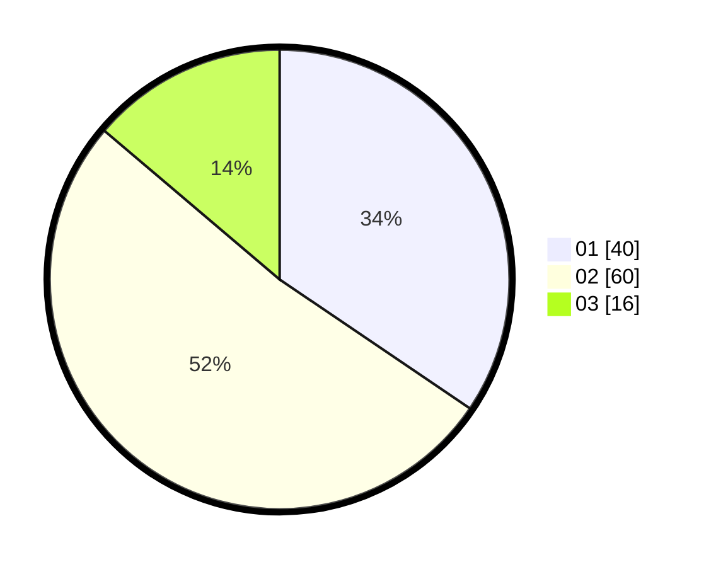

# Hasil

Hasil perolehan suara paslon dapat dilihat pada file paslon-01.txt, paslon-02.txt, dan paslon-03.txt.

Jika tidak ada, artinya data tersebut belum ada pada SIREKAP.

## Perolehan Suara

 * Paslon 01: **40**.
 * Paslon 02: **60**.
 * Paslon 03: **16**.

## Foto C Plano

https://sirekap-obj-formc.kpu.go.id/5c5f/pemilu/ppwp/31/73/01/10/06/3173011006211-20240214-191841--8594dc57-5d33-4abd-b4f3-589a6b336011.jpg

https://sirekap-obj-formc.kpu.go.id/5c5f/pemilu/ppwp/31/73/01/10/06/3173011006211-20240214-191900--e59f2cf5-49c0-4a4a-a292-c6e8bbc06dac.jpg

https://sirekap-obj-formc.kpu.go.id/5c5f/pemilu/ppwp/31/73/01/10/06/3173011006211-20240214-191912--d1328715-d247-484d-942f-9a9fc2582ef4.jpg

## DATA PEMILIH TETAP

Jumlah pemilih dalam DPT: **111**.
 * L: **54**.
 * P: **57**.

## DATA PENGGUNA HAK PILIH

Jumlah pengguna hak pilih dalam DPT: **111**.
 * L: **54**.
 * P: **57**.

Jumlah pengguna hak pilih dalam DPTb: **0**.
 * L: **0**.
 * P: **0**.

Jumlah pengguna hak pilih dalam DPK: **6**.
 * L: **2**.
 * P: **4**.

Jumlah pengguna hak pilih: **117**.
 * L: **56**.
 * P: **61**.

## JUMLAH SUARA SAH DAN TIDAK SAH

JUMLAH SELURUH SUARA SAH: **116**.

JUMLAH SUARA TIDAK SAH: **1**.

JUMLAH SELURUH SUARA SAH DAN SUARA TIDAK SAH: **117**.
