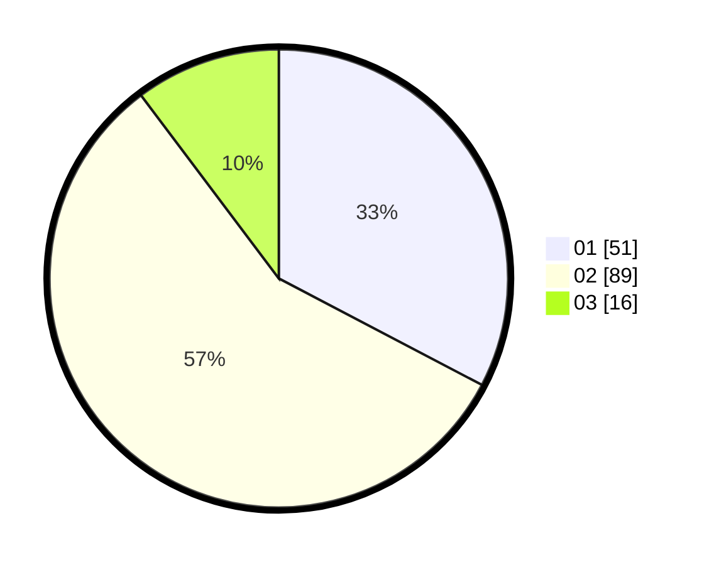

# Hasil

Hasil perolehan suara paslon dapat dilihat pada file paslon-01.txt, paslon-02.txt, dan paslon-03.txt.

Jika tidak ada, artinya data tersebut belum ada pada SIREKAP.

## Perolehan Suara

 * Paslon 01: **51**.
 * Paslon 02: **89**.
 * Paslon 03: **16**.

## Foto C Plano

https://sirekap-obj-formc.kpu.go.id/29ec/pemilu/ppwp/31/73/01/10/06/3173011006213-20240214-223219--2fd5c53c-1263-449f-9a54-5e6ec3df81ba.jpg

https://sirekap-obj-formc.kpu.go.id/29ec/pemilu/ppwp/31/73/01/10/06/3173011006213-20240214-223506--8636dc6e-c8e9-4fda-b9a6-78a11dd65391.jpg

https://sirekap-obj-formc.kpu.go.id/29ec/pemilu/ppwp/31/73/01/10/06/3173011006213-20240214-223826--7eb600f6-d846-4914-b4a7-53cb3f05dba7.jpg

## DATA PEMILIH TETAP

Jumlah pemilih dalam DPT: **190**.
 * L: **103**.
 * P: **87**.

## DATA PENGGUNA HAK PILIH

Jumlah pengguna hak pilih dalam DPT: **151**.
 * L: **81**.
 * P: **70**.

Jumlah pengguna hak pilih dalam DPTb: **3**.
 * L: **0**.
 * P: **3**.

Jumlah pengguna hak pilih dalam DPK: **2**.
 * L: **1**.
 * P: **1**.

Jumlah pengguna hak pilih: **156**.
 * L: **82**.
 * P: **74**.

## JUMLAH SUARA SAH DAN TIDAK SAH

JUMLAH SELURUH SUARA SAH: **156**.

JUMLAH SUARA TIDAK SAH: **0**.

JUMLAH SELURUH SUARA SAH DAN SUARA TIDAK SAH: **156**.
