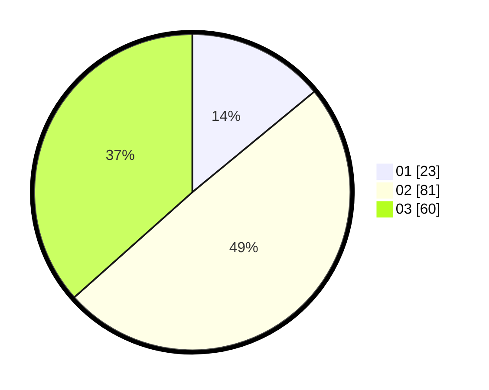

# Hasil

Hasil perolehan suara paslon dapat dilihat pada file paslon-01.txt, paslon-02.txt, dan paslon-03.txt.

Jika tidak ada, artinya data tersebut belum ada pada SIREKAP.

## Perolehan Suara

 * Paslon 01: **23**.
 * Paslon 02: **81**.
 * Paslon 03: **60**.

## Foto C Plano

https://sirekap-obj-formc.kpu.go.id/b854/pemilu/ppwp/31/73/01/10/06/3173011006214-20240214-204956--1dfcd62c-02a7-48d1-87d2-a3c1150ebc0c.jpg

https://sirekap-obj-formc.kpu.go.id/b854/pemilu/ppwp/31/73/01/10/06/3173011006214-20240214-205036--16994a84-d83d-48b0-8610-f6eb4f28a196.jpg

https://sirekap-obj-formc.kpu.go.id/b854/pemilu/ppwp/31/73/01/10/06/3173011006214-20240214-205130--0366c365-e682-4528-8a9c-6865fe4efdcb.jpg
