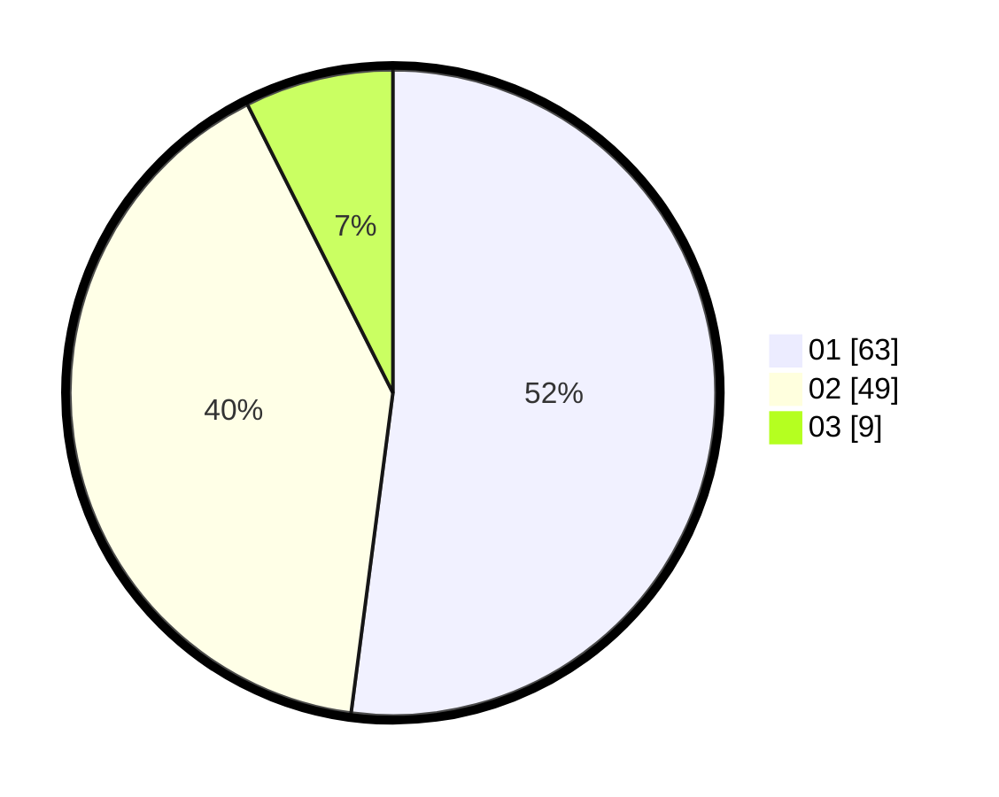

# Hasil

Hasil perolehan suara paslon dapat dilihat pada file paslon-01.txt, paslon-02.txt, dan paslon-03.txt.

Jika tidak ada, artinya data tersebut belum ada pada SIREKAP.

## Perolehan Suara

 * Paslon 01: **63**.
 * Paslon 02: **49**.
 * Paslon 03: **9**.

## Foto C Plano

https://sirekap-obj-formc.kpu.go.id/ddd1/pemilu/ppwp/31/73/01/10/06/3173011006217-20240216-022139--f173aca5-3da6-425f-986a-3166d8cfa1f4.jpg

https://sirekap-obj-formc.kpu.go.id/ddd1/pemilu/ppwp/31/73/01/10/06/3173011006217-20240216-022146--eeb3fbf1-8dd7-4872-bd01-fb53e769f55c.jpg

https://sirekap-obj-formc.kpu.go.id/ddd1/pemilu/ppwp/31/73/01/10/06/3173011006217-20240216-022142--195924c0-c071-4c83-bace-a72ce0e1e1cd.jpg

## DATA PEMILIH TETAP

Jumlah pemilih dalam DPT: **122**.
 * L: **53**.
 * P: **69**.

## DATA PENGGUNA HAK PILIH

Jumlah pengguna hak pilih dalam DPT: **121**.
 * L: **52**.
 * P: **69**.

Jumlah pengguna hak pilih dalam DPTb: **1**.
 * L: **1**.
 * P: **0**.

Jumlah pengguna hak pilih dalam DPK: **0**.
 * L: **0**.
 * P: **0**.

Jumlah pengguna hak pilih: **122**.
 * L: **53**.
 * P: **69**.

## JUMLAH SUARA SAH DAN TIDAK SAH

JUMLAH SELURUH SUARA SAH: **121**.

JUMLAH SUARA TIDAK SAH: **1**.

JUMLAH SELURUH SUARA SAH DAN SUARA TIDAK SAH: **122**.
