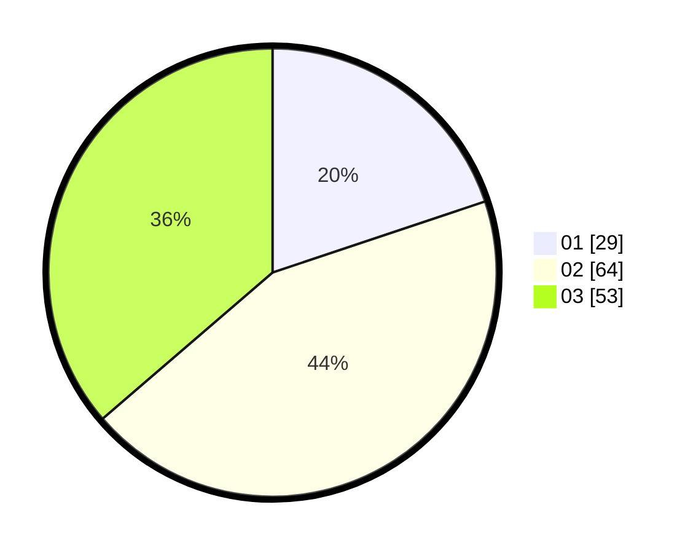

# Hasil

Hasil perolehan suara paslon dapat dilihat pada file paslon-01.txt, paslon-02.txt, dan paslon-03.txt.

Jika tidak ada, artinya data tersebut belum ada pada SIREKAP.

## Perolehan Suara

 * Paslon 01: **29**.
 * Paslon 02: **64**.
 * Paslon 03: **53**.

## Foto C Plano

https://sirekap-obj-formc.kpu.go.id/6794/pemilu/ppwp/31/73/01/10/06/3173011006222-20240216-121820--6bf351af-7d13-432e-b957-55d052c0b153.jpg

https://sirekap-obj-formc.kpu.go.id/6794/pemilu/ppwp/31/73/01/10/06/3173011006222-20240216-121824--ea69a529-deda-4f29-b673-adeafaa91924.jpg

https://sirekap-obj-formc.kpu.go.id/6794/pemilu/ppwp/31/73/01/10/06/3173011006222-20240214-235605--633b5622-feb9-4f5f-8a8e-7132d63a54e5.jpg

## DATA PEMILIH TETAP

Jumlah pemilih dalam DPT: **253**.
 * L: **129**.
 * P: **124**.

## DATA PENGGUNA HAK PILIH

Jumlah pengguna hak pilih dalam DPT: **141**.
 * L: **69**.
 * P: **72**.

Jumlah pengguna hak pilih dalam DPTb: **6**.
 * L: **5**.
 * P: **1**.

Jumlah pengguna hak pilih dalam DPK: **0**.
 * L: **0**.
 * P: **0**.

Jumlah pengguna hak pilih: **147**.
 * L: **74**.
 * P: **73**.

## JUMLAH SUARA SAH DAN TIDAK SAH

JUMLAH SELURUH SUARA SAH: **146**.

JUMLAH SUARA TIDAK SAH: **1**.

JUMLAH SELURUH SUARA SAH DAN SUARA TIDAK SAH: **147**.
