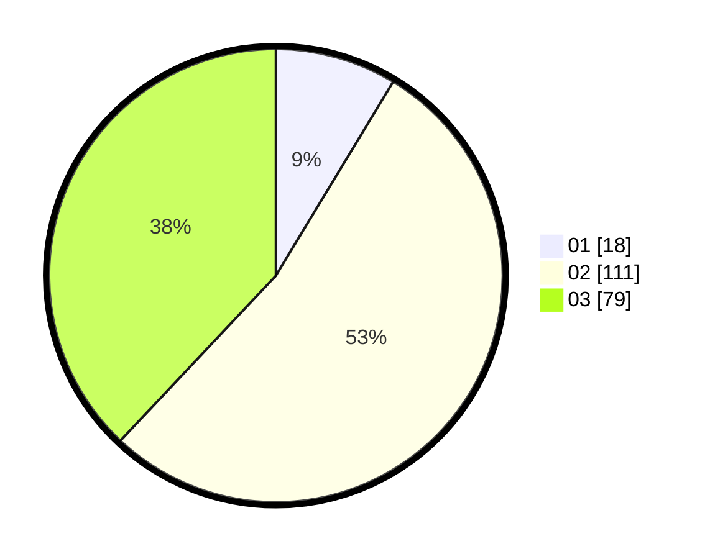

# Hasil

Hasil perolehan suara paslon dapat dilihat pada file paslon-01.txt, paslon-02.txt, dan paslon-03.txt.

Jika tidak ada, artinya data tersebut belum ada pada SIREKAP.

## Perolehan Suara

 * Paslon 01: **18**.
 * Paslon 02: **111**.
 * Paslon 03: **79**.

## Foto C Plano

https://sirekap-obj-formc.kpu.go.id/2434/pemilu/ppwp/31/73/01/10/06/3173011006226-20240215-011428--23b18393-0634-41f5-b8a6-1d88199638fc.jpg

https://sirekap-obj-formc.kpu.go.id/2434/pemilu/ppwp/31/73/01/10/06/3173011006226-20240215-011512--bd161247-0cb2-40b7-9804-d5d875c67e74.jpg

https://sirekap-obj-formc.kpu.go.id/2434/pemilu/ppwp/31/73/01/10/06/3173011006226-20240215-011544--4845570a-0ab2-4e7b-b49b-7cfb63fd7749.jpg
