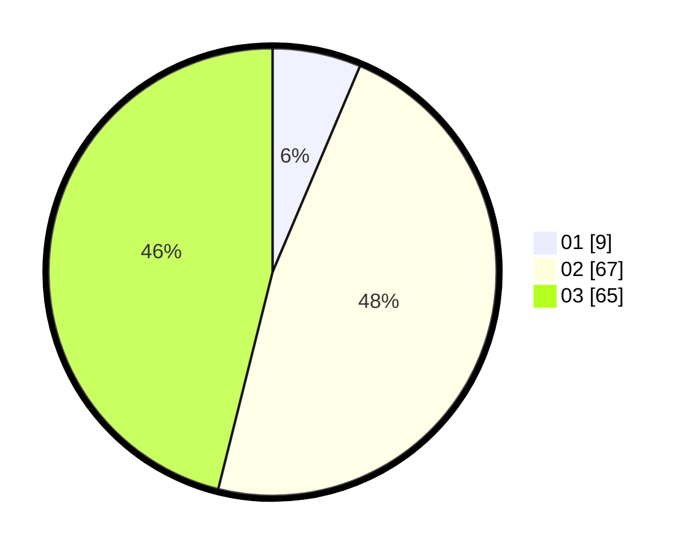

# Hasil

Hasil perolehan suara paslon dapat dilihat pada file paslon-01.txt, paslon-02.txt, dan paslon-03.txt.

Jika tidak ada, artinya data tersebut belum ada pada SIREKAP.

## Perolehan Suara

 * Paslon 01: **9**.
 * Paslon 02: **67**.
 * Paslon 03: **65**.

## Foto C Plano

https://sirekap-obj-formc.kpu.go.id/002d/pemilu/ppwp/31/73/01/10/06/3173011006234-20240214-194049--b2369870-0fd8-404c-925b-59b2b7145426.jpg

https://sirekap-obj-formc.kpu.go.id/002d/pemilu/ppwp/31/73/01/10/06/3173011006234-20240214-194055--5f6a9888-2ccf-46d1-a21b-99e00738607b.jpg

https://sirekap-obj-formc.kpu.go.id/002d/pemilu/ppwp/31/73/01/10/06/3173011006234-20240214-194057--4300ba2e-14a7-446e-89e9-eeb17a57288b.jpg

## DATA PEMILIH TETAP

Jumlah pemilih dalam DPT: **153**.
 * L: **72**.
 * P: **81**.

## DATA PENGGUNA HAK PILIH

Jumlah pengguna hak pilih dalam DPT: **143**.
 * L: **67**.
 * P: **76**.

Jumlah pengguna hak pilih dalam DPTb: **0**.
 * L: **0**.
 * P: **0**.

Jumlah pengguna hak pilih dalam DPK: **10**.
 * L: **5**.
 * P: **5**.

Jumlah pengguna hak pilih: **153**.
 * L: **72**.
 * P: **81**.

## JUMLAH SUARA SAH DAN TIDAK SAH

JUMLAH SELURUH SUARA SAH: **141**.

JUMLAH SUARA TIDAK SAH: **12**.

JUMLAH SELURUH SUARA SAH DAN SUARA TIDAK SAH: **153**.
