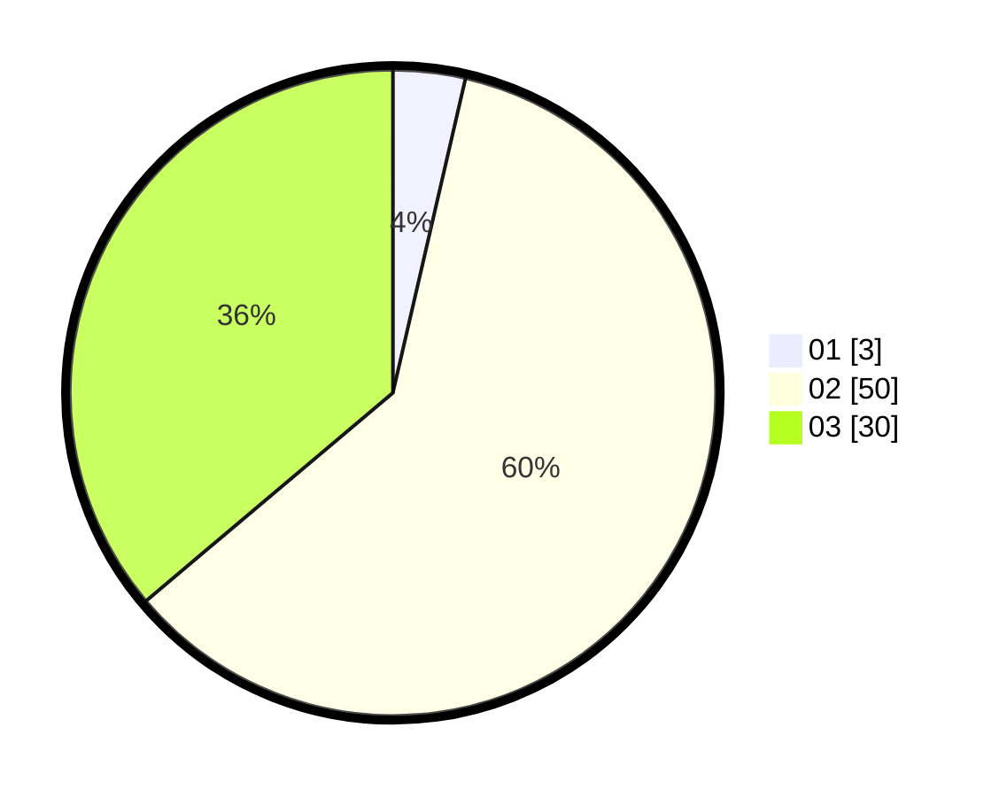

# Hasil

Hasil perolehan suara paslon dapat dilihat pada file paslon-01.txt, paslon-02.txt, dan paslon-03.txt.

Jika tidak ada, artinya data tersebut belum ada pada SIREKAP.

## Perolehan Suara

 * Paslon 01: **3**.
 * Paslon 02: **50**.
 * Paslon 03: **30**.

## Foto C Plano

https://sirekap-obj-formc.kpu.go.id/9db3/pemilu/ppwp/31/73/01/10/06/3173011006236-20240219-145529--c36ba505-652f-49c7-a0e3-36ed5ed88cfc.jpg

https://sirekap-obj-formc.kpu.go.id/9db3/pemilu/ppwp/31/73/01/10/06/3173011006236-20240219-155428--eb0517ef-b2eb-425d-b7c2-7a52cd8277a8.jpg

https://sirekap-obj-formc.kpu.go.id/9db3/pemilu/ppwp/31/73/01/10/06/3173011006236-20240219-145850--dcdb48b4-c9f9-4e2a-a3a2-22eb4d4def39.jpg

## DATA PEMILIH TETAP

Jumlah pemilih dalam DPT: **165**.
 * L: **77**.
 * P: **88**.

## DATA PENGGUNA HAK PILIH

Jumlah pengguna hak pilih dalam DPT: **81**.
 * L: **36**.
 * P: **45**.

Jumlah pengguna hak pilih dalam DPTb: **4**.
 * L: **2**.
 * P: **2**.

Jumlah pengguna hak pilih dalam DPK: **0**.
 * L: **0**.
 * P: **0**.

Jumlah pengguna hak pilih: **85**.
 * L: **38**.
 * P: **47**.

## JUMLAH SUARA SAH DAN TIDAK SAH

JUMLAH SELURUH SUARA SAH: **83**.

JUMLAH SUARA TIDAK SAH: **2**.

JUMLAH SELURUH SUARA SAH DAN SUARA TIDAK SAH: **85**.
