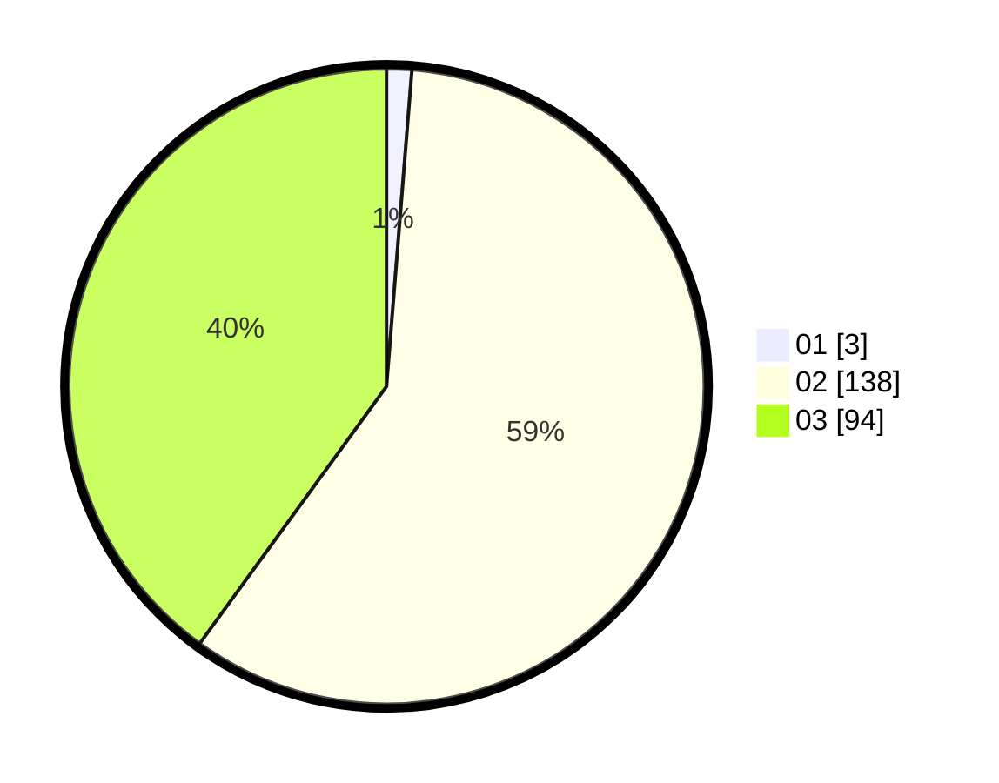

# Hasil

Hasil perolehan suara paslon dapat dilihat pada file paslon-01.txt, paslon-02.txt, dan paslon-03.txt.

Jika tidak ada, artinya data tersebut belum ada pada SIREKAP.

## Perolehan Suara

 * Paslon 01: **3**.
 * Paslon 02: **138**.
 * Paslon 03: **94**.

## Foto C Plano

https://sirekap-obj-formc.kpu.go.id/43d5/pemilu/ppwp/31/73/01/10/06/3173011006237-20240214-233747--04bc1163-3369-4e39-9869-b9ba82290550.jpg

https://sirekap-obj-formc.kpu.go.id/43d5/pemilu/ppwp/31/73/01/10/06/3173011006237-20240214-233806--e3d3f10f-93ba-4da8-8642-7817a09bee39.jpg

https://sirekap-obj-formc.kpu.go.id/43d5/pemilu/ppwp/31/73/01/10/06/3173011006237-20240214-233727--3aa017d3-80df-4647-a56d-76c3ebfd8a43.jpg

## DATA PEMILIH TETAP

Jumlah pemilih dalam DPT: **290**.
 * L: **135**.
 * P: **155**.

## DATA PENGGUNA HAK PILIH

Jumlah pengguna hak pilih dalam DPT: **222**.
 * L: **103**.
 * P: **119**.

Jumlah pengguna hak pilih dalam DPTb: **4**.
 * L: **2**.
 * P: **2**.

Jumlah pengguna hak pilih dalam DPK: **13**.
 * L: **6**.
 * P: **7**.

Jumlah pengguna hak pilih: **239**.
 * L: **111**.
 * P: **128**.

## JUMLAH SUARA SAH DAN TIDAK SAH

JUMLAH SELURUH SUARA SAH: **235**.

JUMLAH SUARA TIDAK SAH: **4**.

JUMLAH SELURUH SUARA SAH DAN SUARA TIDAK SAH: **239**.
