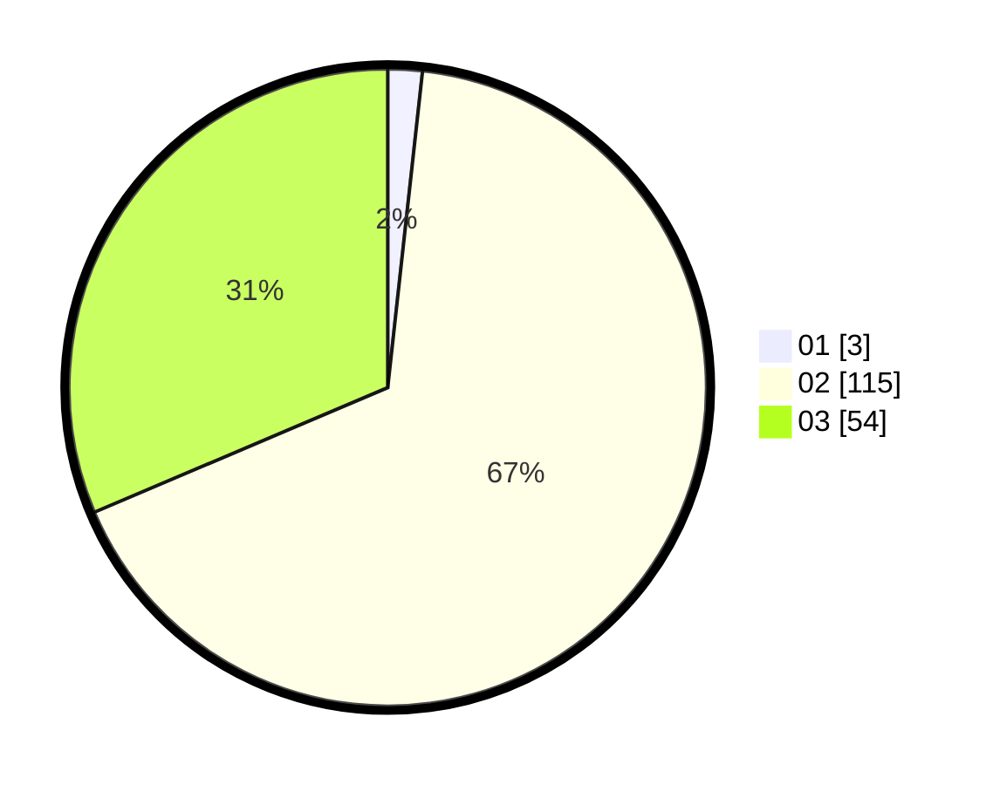

# Hasil

Hasil perolehan suara paslon dapat dilihat pada file paslon-01.txt, paslon-02.txt, dan paslon-03.txt.

Jika tidak ada, artinya data tersebut belum ada pada SIREKAP.

## Perolehan Suara

 * Paslon 01: **3**.
 * Paslon 02: **115**.
 * Paslon 03: **54**.

## Foto C Plano

https://sirekap-obj-formc.kpu.go.id/7add/pemilu/ppwp/31/73/01/10/06/3173011006242-20240214-210612--f5e0def3-279a-432d-a98e-daa3018a3c67.jpg

https://sirekap-obj-formc.kpu.go.id/7add/pemilu/ppwp/31/73/01/10/06/3173011006242-20240214-210652--1b77da85-1ee9-4bf8-a19f-b83a1e71f622.jpg

https://sirekap-obj-formc.kpu.go.id/7add/pemilu/ppwp/31/73/01/10/06/3173011006242-20240214-210657--17f18351-d091-4c39-ab05-1dfbfc1c3553.jpg
