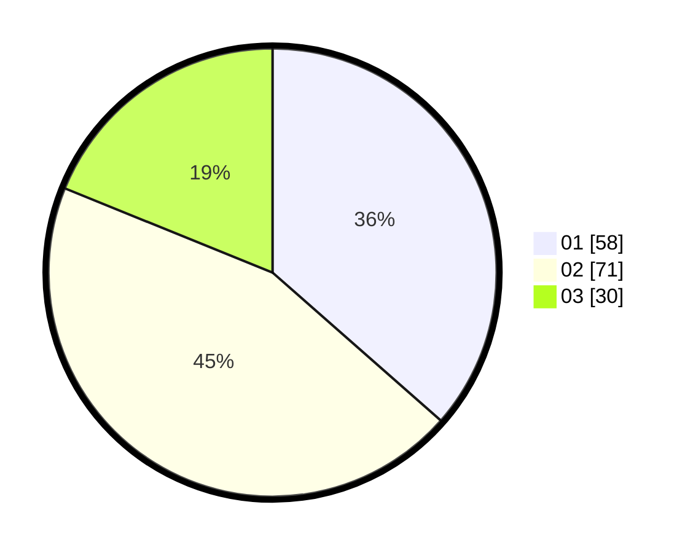

# Hasil

Hasil perolehan suara paslon dapat dilihat pada file paslon-01.txt, paslon-02.txt, dan paslon-03.txt.

Jika tidak ada, artinya data tersebut belum ada pada SIREKAP.

## Perolehan Suara

 * Paslon 01: **58**.
 * Paslon 02: **71**.
 * Paslon 03: **30**.

## Foto C Plano

https://sirekap-obj-formc.kpu.go.id/b8e7/pemilu/ppwp/31/73/01/10/06/3173011006246-20240216-151535--dc57ddf6-acff-406b-8eff-351610d0fb76.jpg

https://sirekap-obj-formc.kpu.go.id/b8e7/pemilu/ppwp/31/73/01/10/06/3173011006246-20240214-204955--b7984506-0be0-48c6-8cf1-a6eae218769d.jpg

https://sirekap-obj-formc.kpu.go.id/b8e7/pemilu/ppwp/31/73/01/10/06/3173011006246-20240214-205038--0638fd6e-655c-4ff2-abd3-09341d262485.jpg

## DATA PEMILIH TETAP

Jumlah pemilih dalam DPT: **189**.
 * L: **93**.
 * P: **96**.

## DATA PENGGUNA HAK PILIH

Jumlah pengguna hak pilih dalam DPT: **153**.
 * L: **70**.
 * P: **83**.

Jumlah pengguna hak pilih dalam DPTb: **5**.
 * L: **0**.
 * P: **5**.

Jumlah pengguna hak pilih dalam DPK: **1**.
 * L: **1**.
 * P: **0**.

Jumlah pengguna hak pilih: **159**.
 * L: **71**.
 * P: **88**.

## JUMLAH SUARA SAH DAN TIDAK SAH

JUMLAH SELURUH SUARA SAH: **159**.

JUMLAH SUARA TIDAK SAH: **0**.

JUMLAH SELURUH SUARA SAH DAN SUARA TIDAK SAH: **159**.
