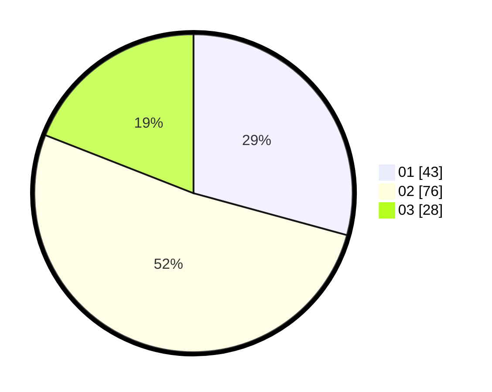

# Hasil

Hasil perolehan suara paslon dapat dilihat pada file paslon-01.txt, paslon-02.txt, dan paslon-03.txt.

Jika tidak ada, artinya data tersebut belum ada pada SIREKAP.

## Perolehan Suara

 * Paslon 01: **43**.
 * Paslon 02: **76**.
 * Paslon 03: **28**.

## Foto C Plano

https://sirekap-obj-formc.kpu.go.id/86c2/pemilu/ppwp/31/73/01/10/06/3173011006247-20240216-005147--2ec3fbbc-4092-4f02-a968-68b07376d8a7.jpg

https://sirekap-obj-formc.kpu.go.id/86c2/pemilu/ppwp/31/73/01/10/06/3173011006247-20240216-005150--1cea1fdc-d95c-47f1-8a7f-cb660fc4c156.jpg

https://sirekap-obj-formc.kpu.go.id/86c2/pemilu/ppwp/31/73/01/10/06/3173011006247-20240216-005148--bccbac3c-e40b-48d0-9945-7e2de6341d5d.jpg

## DATA PEMILIH TETAP

Jumlah pemilih dalam DPT: **196**.
 * L: **95**.
 * P: **101**.

## DATA PENGGUNA HAK PILIH

Jumlah pengguna hak pilih dalam DPT: **147**.
 * L: **68**.
 * P: **79**.

Jumlah pengguna hak pilih dalam DPTb: **4**.
 * L: **2**.
 * P: **2**.

Jumlah pengguna hak pilih dalam DPK: **2**.
 * L: **1**.
 * P: **1**.

Jumlah pengguna hak pilih: **153**.
 * L: **71**.
 * P: **82**.

## JUMLAH SUARA SAH DAN TIDAK SAH

JUMLAH SELURUH SUARA SAH: **147**.

JUMLAH SUARA TIDAK SAH: **6**.

JUMLAH SELURUH SUARA SAH DAN SUARA TIDAK SAH: **153**.
