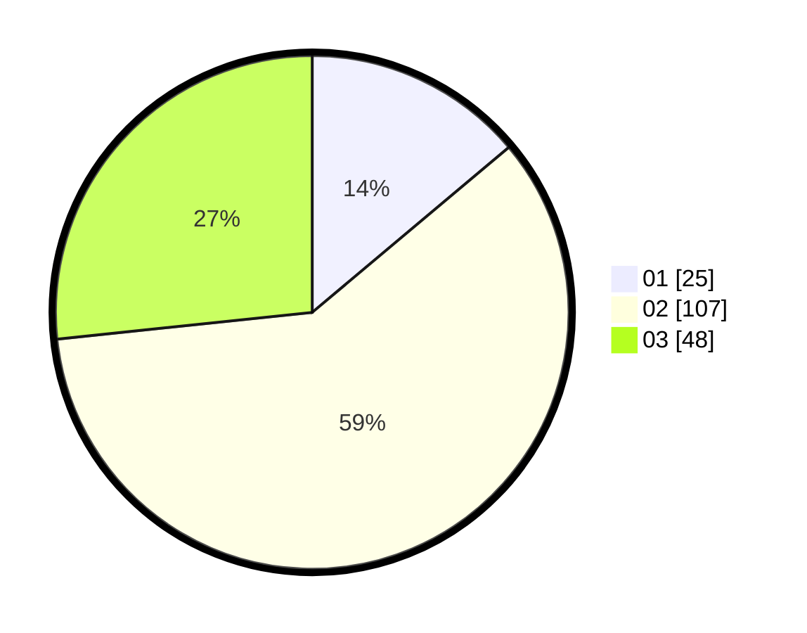

# Hasil

Hasil perolehan suara paslon dapat dilihat pada file paslon-01.txt, paslon-02.txt, dan paslon-03.txt.

Jika tidak ada, artinya data tersebut belum ada pada SIREKAP.

## Perolehan Suara

 * Paslon 01: **25**.
 * Paslon 02: **107**.
 * Paslon 03: **48**.

## Foto C Plano

https://sirekap-obj-formc.kpu.go.id/b720/pemilu/ppwp/31/73/01/10/06/3173011006253-20240217-171602--bc17f234-29ca-4be6-938a-fea188e82ac1.jpg

https://sirekap-obj-formc.kpu.go.id/b720/pemilu/ppwp/31/73/01/10/06/3173011006253-20240217-171603--7a3a07f0-4bb7-4cb9-96ab-9a5eb45a28a0.jpg

https://sirekap-obj-formc.kpu.go.id/b720/pemilu/ppwp/31/73/01/10/06/3173011006253-20240217-171602--700f56d6-3289-4449-8f1f-6c0616c2101f.jpg

## DATA PEMILIH TETAP

Jumlah pemilih dalam DPT: **288**.
 * L: **152**.
 * P: **136**.

## DATA PENGGUNA HAK PILIH

Jumlah pengguna hak pilih dalam DPT: **186**.
 * L: **93**.
 * P: **93**.

Jumlah pengguna hak pilih dalam DPTb: **0**.
 * L: **0**.
 * P: **0**.

Jumlah pengguna hak pilih dalam DPK: **1**.
 * L: **1**.
 * P: **0**.

Jumlah pengguna hak pilih: **187**.
 * L: **94**.
 * P: **93**.

## JUMLAH SUARA SAH DAN TIDAK SAH

JUMLAH SELURUH SUARA SAH: **0**.

JUMLAH SUARA TIDAK SAH: **0**.

JUMLAH SELURUH SUARA SAH DAN SUARA TIDAK SAH: **0**.
