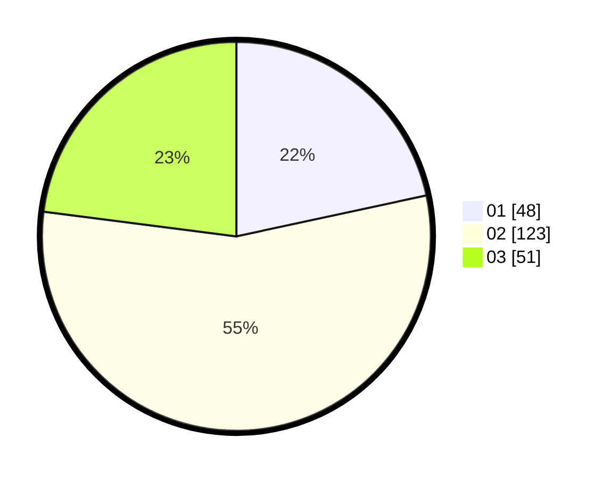

# Hasil

Hasil perolehan suara paslon dapat dilihat pada file paslon-01.txt, paslon-02.txt, dan paslon-03.txt.

Jika tidak ada, artinya data tersebut belum ada pada SIREKAP.

## Perolehan Suara

 * Paslon 01: **48**.
 * Paslon 02: **123**.
 * Paslon 03: **51**.

## Foto C Plano

https://sirekap-obj-formc.kpu.go.id/6813/pemilu/ppwp/31/73/01/10/06/3173011006254-20240216-015335--80cdbaac-7dd7-4990-a8da-ecbe7c52dc6b.jpg

https://sirekap-obj-formc.kpu.go.id/6813/pemilu/ppwp/31/73/01/10/06/3173011006254-20240216-015352--1ae4f747-e1bc-473a-901d-089793cd2583.jpg

https://sirekap-obj-formc.kpu.go.id/6813/pemilu/ppwp/31/73/01/10/06/3173011006254-20240216-065043--947e1dc0-bbb3-48c2-be6c-4178d7f669ed.jpg

## DATA PEMILIH TETAP

Jumlah pemilih dalam DPT: **295**.
 * L: **149**.
 * P: **146**.

## DATA PENGGUNA HAK PILIH

Jumlah pengguna hak pilih dalam DPT: **221**.
 * L: **108**.
 * P: **113**.

Jumlah pengguna hak pilih dalam DPTb: **3**.
 * L: **2**.
 * P: **1**.

Jumlah pengguna hak pilih dalam DPK: **0**.
 * L: **0**.
 * P: **0**.

Jumlah pengguna hak pilih: **224**.
 * L: **110**.
 * P: **114**.

## JUMLAH SUARA SAH DAN TIDAK SAH

JUMLAH SELURUH SUARA SAH: **222**.

JUMLAH SUARA TIDAK SAH: **2**.

JUMLAH SELURUH SUARA SAH DAN SUARA TIDAK SAH: **224**.
