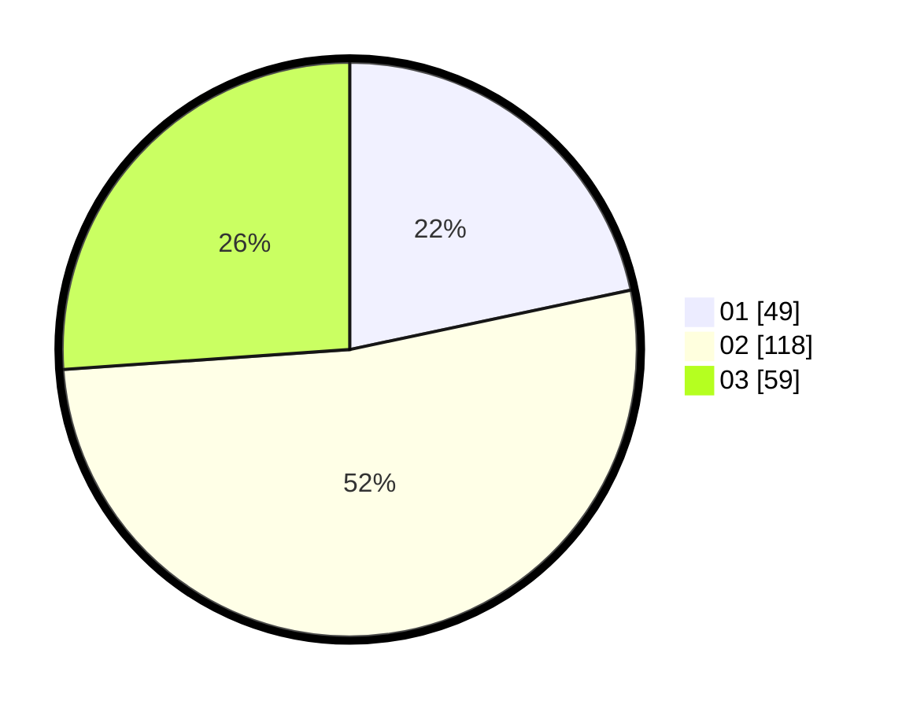

# Hasil

Hasil perolehan suara paslon dapat dilihat pada file paslon-01.txt, paslon-02.txt, dan paslon-03.txt.

Jika tidak ada, artinya data tersebut belum ada pada SIREKAP.

## Perolehan Suara

 * Paslon 01: **49**.
 * Paslon 02: **118**.
 * Paslon 03: **59**.

## Foto C Plano

https://sirekap-obj-formc.kpu.go.id/ca1c/pemilu/ppwp/31/73/01/10/06/3173011006256-20240215-215419--0924bf56-0d16-47a8-848b-53a8938ce169.jpg

https://sirekap-obj-formc.kpu.go.id/ca1c/pemilu/ppwp/31/73/01/10/06/3173011006256-20240215-215423--11fdfa78-181d-4fde-b857-2c33d08ea565.jpg

https://sirekap-obj-formc.kpu.go.id/ca1c/pemilu/ppwp/31/73/01/10/06/3173011006256-20240215-215421--0c532705-106d-4eb9-9773-72de191be185.jpg

## DATA PEMILIH TETAP

Jumlah pemilih dalam DPT: **219**.
 * L: **103**.
 * P: **116**.

## DATA PENGGUNA HAK PILIH

Jumlah pengguna hak pilih dalam DPT: **219**.
 * L: **103**.
 * P: **116**.

Jumlah pengguna hak pilih dalam DPTb: **5**.
 * L: **3**.
 * P: **2**.

Jumlah pengguna hak pilih dalam DPK: **5**.
 * L: **3**.
 * P: **2**.

Jumlah pengguna hak pilih: **229**.
 * L: **109**.
 * P: **120**.

## JUMLAH SUARA SAH DAN TIDAK SAH

JUMLAH SELURUH SUARA SAH: **226**.

JUMLAH SUARA TIDAK SAH: **3**.

JUMLAH SELURUH SUARA SAH DAN SUARA TIDAK SAH: **229**.
