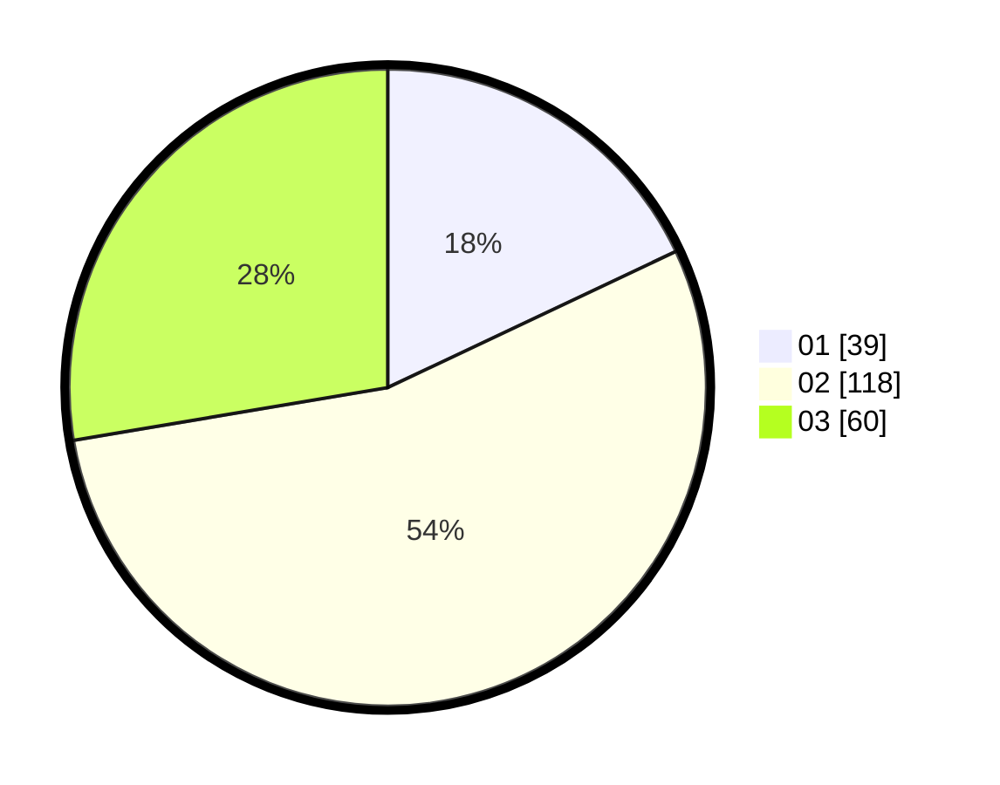

# Hasil

Hasil perolehan suara paslon dapat dilihat pada file paslon-01.txt, paslon-02.txt, dan paslon-03.txt.

Jika tidak ada, artinya data tersebut belum ada pada SIREKAP.

## Perolehan Suara

 * Paslon 01: **39**.
 * Paslon 02: **118**.
 * Paslon 03: **60**.

## Foto C Plano

https://sirekap-obj-formc.kpu.go.id/16f7/pemilu/ppwp/31/73/01/10/06/3173011006257-20240216-010018--26b1876c-45d6-4493-b98c-7e3b6b391c01.jpg

https://sirekap-obj-formc.kpu.go.id/16f7/pemilu/ppwp/31/73/01/10/06/3173011006257-20240216-010026--4733c097-6509-4f5e-ad42-827e53c1f356.jpg

https://sirekap-obj-formc.kpu.go.id/16f7/pemilu/ppwp/31/73/01/10/06/3173011006257-20240216-010020--c075d8a1-c7f0-4128-b328-e6d12e3f19ef.jpg

## DATA PEMILIH TETAP

Jumlah pemilih dalam DPT: **281**.
 * L: **143**.
 * P: **138**.

## DATA PENGGUNA HAK PILIH

Jumlah pengguna hak pilih dalam DPT: **214**.
 * L: **102**.
 * P: **112**.

Jumlah pengguna hak pilih dalam DPTb: **4**.
 * L: **2**.
 * P: **2**.

Jumlah pengguna hak pilih dalam DPK: **1**.
 * L: **1**.
 * P: **0**.

Jumlah pengguna hak pilih: **219**.
 * L: **105**.
 * P: **114**.

## JUMLAH SUARA SAH DAN TIDAK SAH

JUMLAH SELURUH SUARA SAH: **217**.

JUMLAH SUARA TIDAK SAH: **2**.

JUMLAH SELURUH SUARA SAH DAN SUARA TIDAK SAH: **219**.
