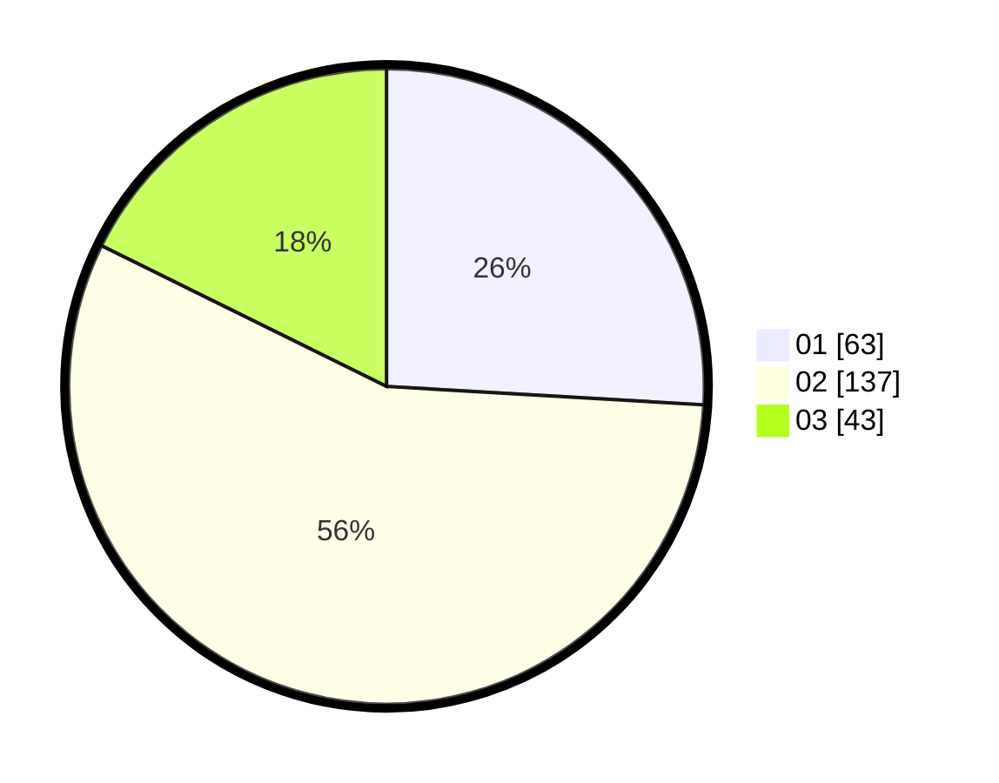

# Hasil

Hasil perolehan suara paslon dapat dilihat pada file paslon-01.txt, paslon-02.txt, dan paslon-03.txt.

Jika tidak ada, artinya data tersebut belum ada pada SIREKAP.

## Perolehan Suara

 * Paslon 01: **63**.
 * Paslon 02: **137**.
 * Paslon 03: **43**.

## Foto C Plano

https://sirekap-obj-formc.kpu.go.id/1e66/pemilu/ppwp/31/73/01/10/06/3173011006259-20240216-151008--a49f107c-b615-47f2-b0f1-1cf9b2719b2e.jpg

https://sirekap-obj-formc.kpu.go.id/1e66/pemilu/ppwp/31/73/01/10/06/3173011006259-20240216-151009--e504cfe9-0af7-4022-8f6d-cdd9c57ab256.jpg

https://sirekap-obj-formc.kpu.go.id/1e66/pemilu/ppwp/31/73/01/10/06/3173011006259-20240216-151009--5de0a324-5afb-41ce-8f8a-34feb9623ee9.jpg

## DATA PEMILIH TETAP

Jumlah pemilih dalam DPT: **287**.
 * L: **149**.
 * P: **138**.

## DATA PENGGUNA HAK PILIH

Jumlah pengguna hak pilih dalam DPT: **235**.
 * L: **112**.
 * P: **124**.

Jumlah pengguna hak pilih dalam DPTb: **1**.
 * L: **1**.
 * P: **0**.

Jumlah pengguna hak pilih dalam DPK: **7**.
 * L: **2**.
 * P: **5**.

Jumlah pengguna hak pilih: **244**.
 * L: **115**.
 * P: **129**.

## JUMLAH SUARA SAH DAN TIDAK SAH

JUMLAH SELURUH SUARA SAH: **243**.

JUMLAH SUARA TIDAK SAH: **1**.

JUMLAH SELURUH SUARA SAH DAN SUARA TIDAK SAH: **244**.
