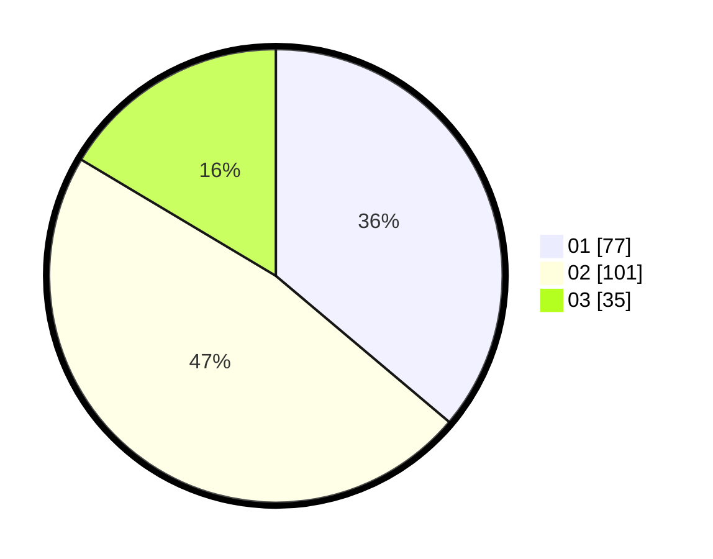

# Hasil

Hasil perolehan suara paslon dapat dilihat pada file paslon-01.txt, paslon-02.txt, dan paslon-03.txt.

Jika tidak ada, artinya data tersebut belum ada pada SIREKAP.

## Perolehan Suara

 * Paslon 01: **77**.
 * Paslon 02: **101**.
 * Paslon 03: **35**.

## Foto C Plano

https://sirekap-obj-formc.kpu.go.id/528b/pemilu/ppwp/31/73/01/10/06/3173011006260-20240216-035042--ab4f0825-f6b6-49b7-9b61-304c2c7bd54f.jpg

https://sirekap-obj-formc.kpu.go.id/528b/pemilu/ppwp/31/73/01/10/06/3173011006260-20240216-035101--cfdd063b-169c-4e17-8b67-eb8fa3beb7d5.jpg

https://sirekap-obj-formc.kpu.go.id/528b/pemilu/ppwp/31/73/01/10/06/3173011006260-20240216-035051--4b7141f3-4ad2-4294-84c2-3e9f70d769b7.jpg

## DATA PEMILIH TETAP

Jumlah pemilih dalam DPT: **284**.
 * L: **151**.
 * P: **133**.

## DATA PENGGUNA HAK PILIH

Jumlah pengguna hak pilih dalam DPT: **212**.
 * L: **111**.
 * P: **101**.

Jumlah pengguna hak pilih dalam DPTb: **2**.
 * L: **0**.
 * P: **2**.

Jumlah pengguna hak pilih dalam DPK: **1**.
 * L: **1**.
 * P: **0**.

Jumlah pengguna hak pilih: **215**.
 * L: **112**.
 * P: **103**.

## JUMLAH SUARA SAH DAN TIDAK SAH

JUMLAH SELURUH SUARA SAH: **213**.

JUMLAH SUARA TIDAK SAH: **2**.

JUMLAH SELURUH SUARA SAH DAN SUARA TIDAK SAH: **215**.
