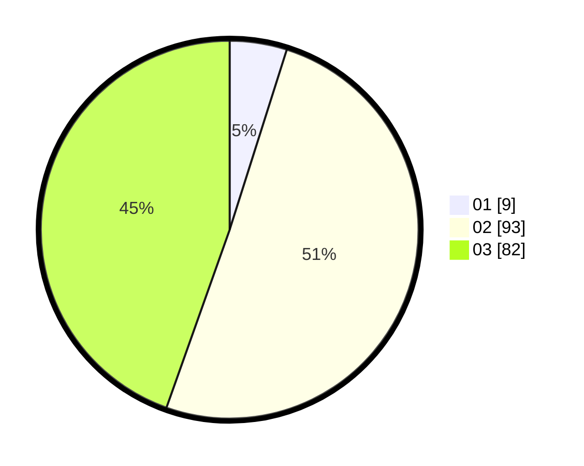

# Hasil

Hasil perolehan suara paslon dapat dilihat pada file paslon-01.txt, paslon-02.txt, dan paslon-03.txt.

Jika tidak ada, artinya data tersebut belum ada pada SIREKAP.

## Perolehan Suara

 * Paslon 01: **9**.
 * Paslon 02: **93**.
 * Paslon 03: **82**.

## Foto C Plano

https://sirekap-obj-formc.kpu.go.id/436f/pemilu/ppwp/31/73/01/10/06/3173011006261-20240216-110050--c8c6629c-6650-4ec3-a892-c023dc348286.jpg

https://sirekap-obj-formc.kpu.go.id/436f/pemilu/ppwp/31/73/01/10/06/3173011006261-20240216-110052--51611680-f8b2-4f47-8b31-218a1a597425.jpg

https://sirekap-obj-formc.kpu.go.id/436f/pemilu/ppwp/31/73/01/10/06/3173011006261-20240216-110051--7eb1951f-cf10-457f-bf16-698234fd0827.jpg

## DATA PEMILIH TETAP

Jumlah pemilih dalam DPT: **287**.
 * L: **137**.
 * P: **150**.

## DATA PENGGUNA HAK PILIH

Jumlah pengguna hak pilih dalam DPT: **287**.
 * L: **137**.
 * P: **150**.

Jumlah pengguna hak pilih dalam DPTb: **0**.
 * L: **0**.
 * P: **0**.

Jumlah pengguna hak pilih dalam DPK: **0**.
 * L: **0**.
 * P: **0**.

Jumlah pengguna hak pilih: **287**.
 * L: **137**.
 * P: **150**.

## JUMLAH SUARA SAH DAN TIDAK SAH

JUMLAH SELURUH SUARA SAH: **184**.

JUMLAH SUARA TIDAK SAH: **4**.

JUMLAH SELURUH SUARA SAH DAN SUARA TIDAK SAH: **188**.
