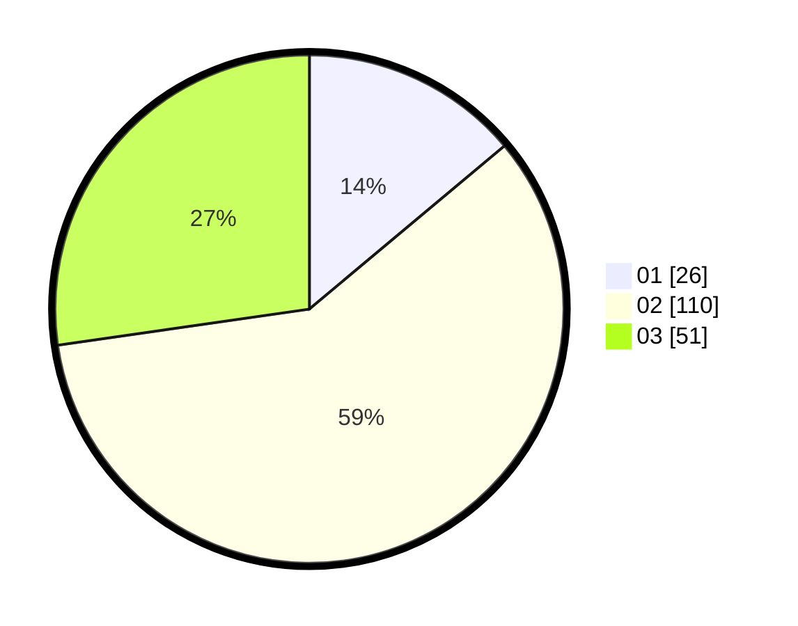

# Hasil

Hasil perolehan suara paslon dapat dilihat pada file paslon-01.txt, paslon-02.txt, dan paslon-03.txt.

Jika tidak ada, artinya data tersebut belum ada pada SIREKAP.

## Perolehan Suara

 * Paslon 01: **26**.
 * Paslon 02: **110**.
 * Paslon 03: **51**.

## Foto C Plano

https://sirekap-obj-formc.kpu.go.id/7203/pemilu/ppwp/31/73/01/10/06/3173011006262-20240216-020301--7d11596f-ae8a-4acb-bf3a-ce3b0d4743c8.jpg

https://sirekap-obj-formc.kpu.go.id/7203/pemilu/ppwp/31/73/01/10/06/3173011006262-20240216-020302--5c742a14-b1c5-42d8-ab36-f39c9ed99e02.jpg

https://sirekap-obj-formc.kpu.go.id/7203/pemilu/ppwp/31/73/01/10/06/3173011006262-20240216-020301--8e261894-2cae-4ae7-bc79-33d80d6cadec.jpg

## DATA PEMILIH TETAP

Jumlah pemilih dalam DPT: **279**.
 * L: **135**.
 * P: **144**.

## DATA PENGGUNA HAK PILIH

Jumlah pengguna hak pilih dalam DPT: **190**.
 * L: **91**.
 * P: **99**.

Jumlah pengguna hak pilih dalam DPTb: **0**.
 * L: **0**.
 * P: **0**.

Jumlah pengguna hak pilih dalam DPK: **0**.
 * L: **0**.
 * P: **0**.

Jumlah pengguna hak pilih: **190**.
 * L: **91**.
 * P: **99**.

## JUMLAH SUARA SAH DAN TIDAK SAH

JUMLAH SELURUH SUARA SAH: **187**.

JUMLAH SUARA TIDAK SAH: **3**.

JUMLAH SELURUH SUARA SAH DAN SUARA TIDAK SAH: **190**.
