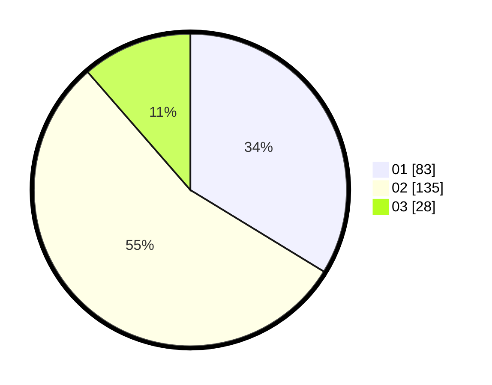

# Hasil

Hasil perolehan suara paslon dapat dilihat pada file paslon-01.txt, paslon-02.txt, dan paslon-03.txt.

Jika tidak ada, artinya data tersebut belum ada pada SIREKAP.

## Perolehan Suara

 * Paslon 01: **83**.
 * Paslon 02: **135**.
 * Paslon 03: **28**.

## Foto C Plano

https://sirekap-obj-formc.kpu.go.id/b124/pemilu/ppwp/31/73/01/10/06/3173011006264-20240216-175730--0c2a6682-6b03-4d66-9b97-71c76d782b33.jpg

https://sirekap-obj-formc.kpu.go.id/b124/pemilu/ppwp/31/73/01/10/06/3173011006264-20240216-175732--12bec4ba-9cc1-476b-b9c1-69297d8b03f6.jpg

https://sirekap-obj-formc.kpu.go.id/b124/pemilu/ppwp/31/73/01/10/06/3173011006264-20240216-175731--5310b659-44cd-4881-b43b-39cafef0a570.jpg

## DATA PEMILIH TETAP

Jumlah pemilih dalam DPT: **294**.
 * L: **158**.
 * P: **136**.

## DATA PENGGUNA HAK PILIH

Jumlah pengguna hak pilih dalam DPT: **239**.
 * L: **125**.
 * P: **114**.

Jumlah pengguna hak pilih dalam DPTb: **12**.
 * L: **5**.
 * P: **7**.

Jumlah pengguna hak pilih dalam DPK: **0**.
 * L: **0**.
 * P: **0**.

Jumlah pengguna hak pilih: **251**.
 * L: **130**.
 * P: **121**.

## JUMLAH SUARA SAH DAN TIDAK SAH

JUMLAH SELURUH SUARA SAH: **246**.

JUMLAH SUARA TIDAK SAH: **5**.

JUMLAH SELURUH SUARA SAH DAN SUARA TIDAK SAH: **251**.
