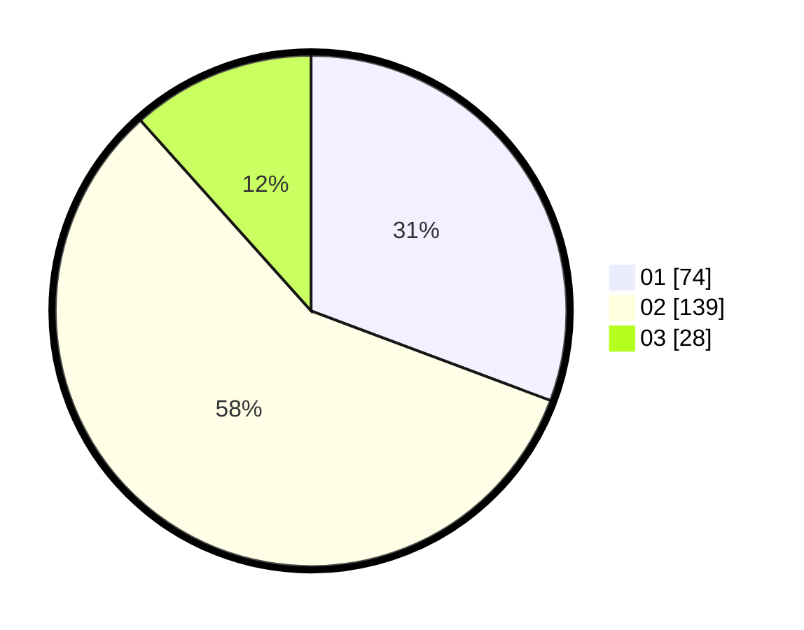

# Hasil

Hasil perolehan suara paslon dapat dilihat pada file paslon-01.txt, paslon-02.txt, dan paslon-03.txt.

Jika tidak ada, artinya data tersebut belum ada pada SIREKAP.

## Perolehan Suara

 * Paslon 01: **74**.
 * Paslon 02: **139**.
 * Paslon 03: **28**.

## Foto C Plano

https://sirekap-obj-formc.kpu.go.id/f08f/pemilu/ppwp/31/73/01/10/06/3173011006269-20240215-021110--201e585e-99eb-4ea6-8e49-c40f6d78cde4.jpg

https://sirekap-obj-formc.kpu.go.id/f08f/pemilu/ppwp/31/73/01/10/06/3173011006269-20240215-032602--ee7ab639-d7a8-4cb3-ab0e-404ac8897d9a.jpg

https://sirekap-obj-formc.kpu.go.id/f08f/pemilu/ppwp/31/73/01/10/06/3173011006269-20240215-021220--6a484dbc-5dde-4ffa-8907-63a151b6084a.jpg

## DATA PEMILIH TETAP

Jumlah pemilih dalam DPT: **291**.
 * L: **144**.
 * P: **147**.

## DATA PENGGUNA HAK PILIH

Jumlah pengguna hak pilih dalam DPT: **236**.
 * L: **115**.
 * P: **121**.

Jumlah pengguna hak pilih dalam DPTb: **8**.
 * L: **0**.
 * P: **8**.

Jumlah pengguna hak pilih dalam DPK: **2**.
 * L: **0**.
 * P: **2**.

Jumlah pengguna hak pilih: **246**.
 * L: **115**.
 * P: **131**.

## JUMLAH SUARA SAH DAN TIDAK SAH

JUMLAH SELURUH SUARA SAH: **241**.

JUMLAH SUARA TIDAK SAH: **5**.

JUMLAH SELURUH SUARA SAH DAN SUARA TIDAK SAH: **246**.
