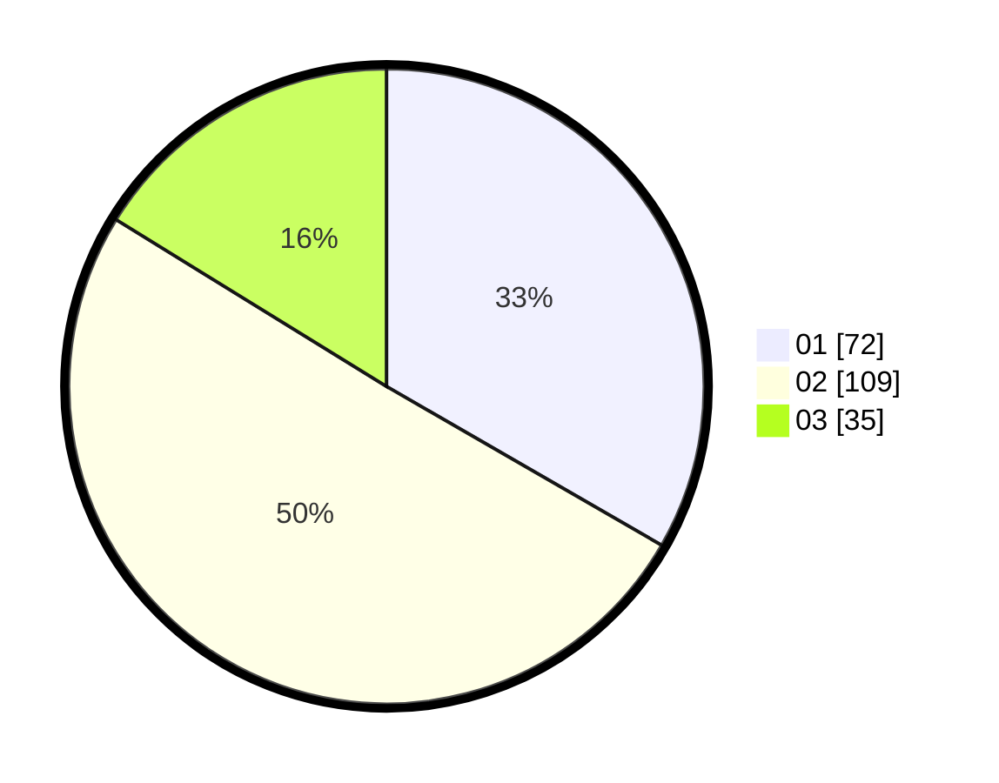

# Hasil

Hasil perolehan suara paslon dapat dilihat pada file paslon-01.txt, paslon-02.txt, dan paslon-03.txt.

Jika tidak ada, artinya data tersebut belum ada pada SIREKAP.

## Perolehan Suara

 * Paslon 01: **72**.
 * Paslon 02: **109**.
 * Paslon 03: **35**.

## Foto C Plano

https://sirekap-obj-formc.kpu.go.id/11eb/pemilu/ppwp/31/73/01/10/06/3173011006272-20240214-193505--63ec3c57-d3fc-472f-b04b-9cafe69974c1.jpg

https://sirekap-obj-formc.kpu.go.id/11eb/pemilu/ppwp/31/73/01/10/06/3173011006272-20240214-193538--81e7fb03-04bc-4d14-b451-3827cd95455f.jpg

https://sirekap-obj-formc.kpu.go.id/11eb/pemilu/ppwp/31/73/01/10/06/3173011006272-20240214-193615--4b3fe5e5-718b-47d4-9eab-1f6c0a7497c4.jpg

## DATA PEMILIH TETAP

Jumlah pemilih dalam DPT: **276**.
 * L: **138**.
 * P: **138**.

## DATA PENGGUNA HAK PILIH

Jumlah pengguna hak pilih dalam DPT: **214**.
 * L: **108**.
 * P: **106**.

Jumlah pengguna hak pilih dalam DPTb: **3**.
 * L: **0**.
 * P: **3**.

Jumlah pengguna hak pilih dalam DPK: **2**.
 * L: **1**.
 * P: **1**.

Jumlah pengguna hak pilih: **219**.
 * L: **109**.
 * P: **110**.

## JUMLAH SUARA SAH DAN TIDAK SAH

JUMLAH SELURUH SUARA SAH: **216**.

JUMLAH SUARA TIDAK SAH: **3**.

JUMLAH SELURUH SUARA SAH DAN SUARA TIDAK SAH: **219**.
