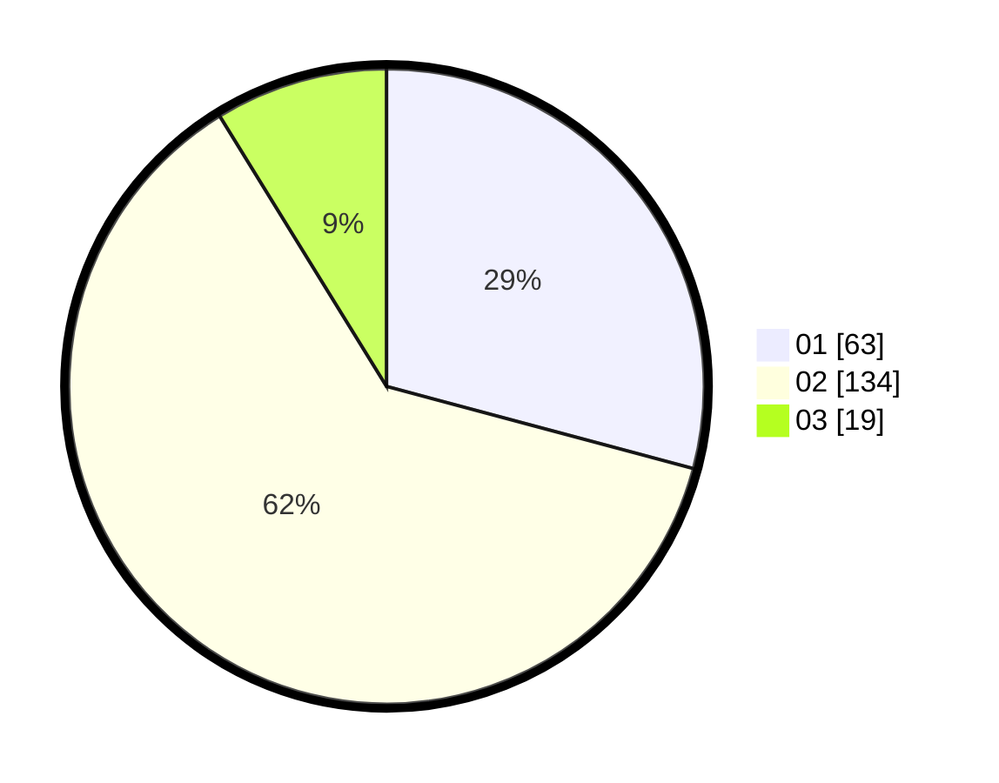

# Hasil

Hasil perolehan suara paslon dapat dilihat pada file paslon-01.txt, paslon-02.txt, dan paslon-03.txt.

Jika tidak ada, artinya data tersebut belum ada pada SIREKAP.

## Perolehan Suara

 * Paslon 01: **63**.
 * Paslon 02: **134**.
 * Paslon 03: **19**.

## Foto C Plano

https://sirekap-obj-formc.kpu.go.id/98d2/pemilu/ppwp/31/73/01/10/06/3173011006273-20240214-232928--28cce598-8a2d-47c2-85c9-6c1b54bea3d4.jpg

https://sirekap-obj-formc.kpu.go.id/98d2/pemilu/ppwp/31/73/01/10/06/3173011006273-20240215-004449--ca3a4d29-a1d3-469b-8633-8071230f9c1f.jpg

https://sirekap-obj-formc.kpu.go.id/98d2/pemilu/ppwp/31/73/01/10/06/3173011006273-20240215-004607--0b378c95-dae5-42ad-bf97-30bf01ec6fe3.jpg
