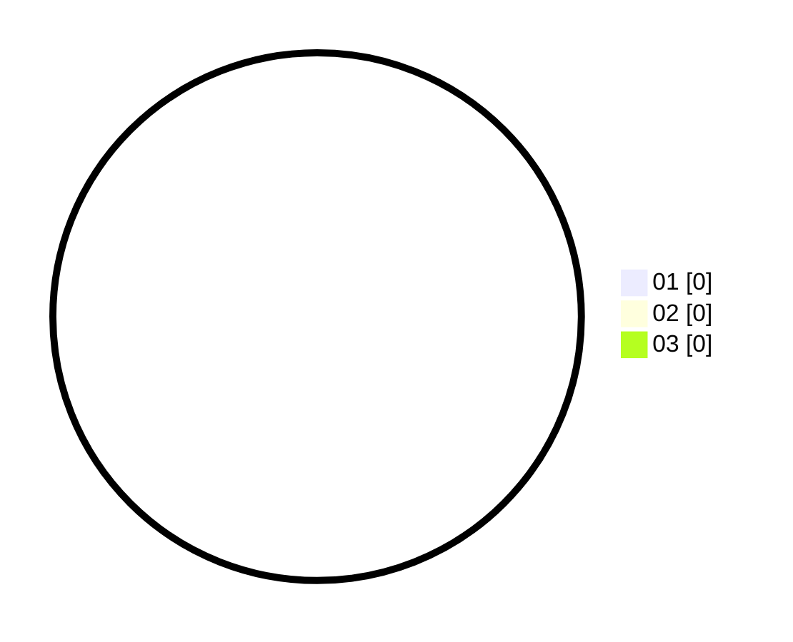

# Hasil

Hasil perolehan suara paslon dapat dilihat pada file paslon-01.txt, paslon-02.txt, dan paslon-03.txt.

Jika tidak ada, artinya data tersebut belum ada pada SIREKAP.

## Perolehan Suara

 * Paslon 01: **0**.
 * Paslon 02: **0**.
 * Paslon 03: **0**.

## Foto C Plano

https://sirekap-obj-formc.kpu.go.id/a8e9/pemilu/ppwp/31/73/01/10/06/3173011006276-20240214-220101--5aa8d10e-f2f9-4da1-8715-db8cbea11af5.jpg

https://sirekap-obj-formc.kpu.go.id/a8e9/pemilu/ppwp/31/73/01/10/06/3173011006276-20240214-203839--f7ed79aa-f7de-4fe9-9cb4-3b55cf1e3109.jpg

https://sirekap-obj-formc.kpu.go.id/a8e9/pemilu/ppwp/31/73/01/10/06/3173011006276-20240214-203842--3370c1a5-6776-4d14-ae9d-a566d269dc00.jpg
