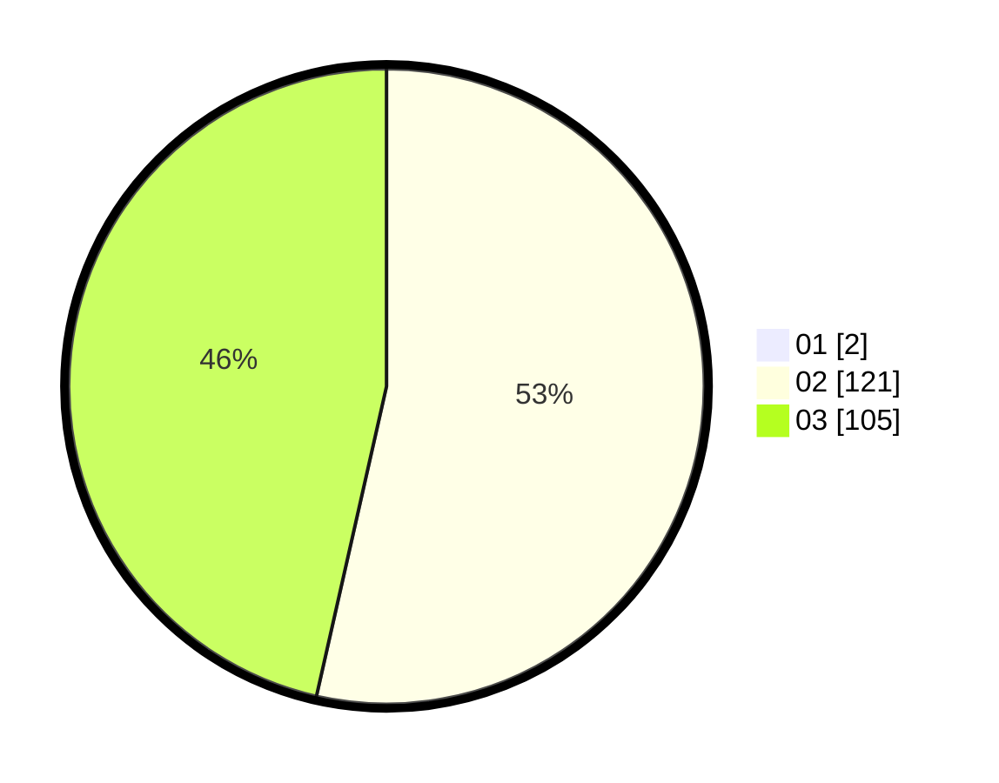

# Hasil

Hasil perolehan suara paslon dapat dilihat pada file paslon-01.txt, paslon-02.txt, dan paslon-03.txt.

Jika tidak ada, artinya data tersebut belum ada pada SIREKAP.

## Perolehan Suara

 * Paslon 01: **2**.
 * Paslon 02: **121**.
 * Paslon 03: **105**.

## Foto C Plano

https://sirekap-obj-formc.kpu.go.id/3c73/pemilu/ppwp/31/73/01/10/06/3173011006277-20240214-200440--fbd8e798-4951-438c-b3e2-7ce46eb9181e.jpg

https://sirekap-obj-formc.kpu.go.id/3c73/pemilu/ppwp/31/73/01/10/06/3173011006277-20240214-212518--7aca0c4d-4808-483c-99ba-0c76a9275723.jpg

https://sirekap-obj-formc.kpu.go.id/3c73/pemilu/ppwp/31/73/01/10/06/3173011006277-20240214-200932--5f1b702a-2f8d-405b-875b-ccc4d8c22a82.jpg

## DATA PEMILIH TETAP

Jumlah pemilih dalam DPT: **298**.
 * L: **147**.
 * P: **151**.

## DATA PENGGUNA HAK PILIH

Jumlah pengguna hak pilih dalam DPT: **216**.
 * L: **109**.
 * P: **107**.

Jumlah pengguna hak pilih dalam DPTb: **9**.
 * L: **3**.
 * P: **6**.

Jumlah pengguna hak pilih dalam DPK: **5**.
 * L: **2**.
 * P: **3**.

Jumlah pengguna hak pilih: **230**.
 * L: **114**.
 * P: **116**.

## JUMLAH SUARA SAH DAN TIDAK SAH

JUMLAH SELURUH SUARA SAH: **228**.

JUMLAH SUARA TIDAK SAH: **2**.

JUMLAH SELURUH SUARA SAH DAN SUARA TIDAK SAH: **230**.
