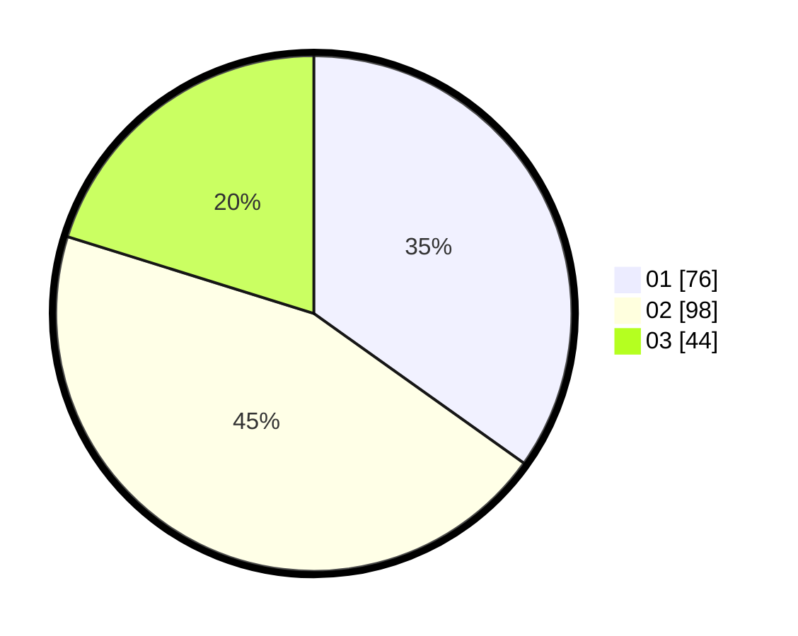

# Hasil

Hasil perolehan suara paslon dapat dilihat pada file paslon-01.txt, paslon-02.txt, dan paslon-03.txt.

Jika tidak ada, artinya data tersebut belum ada pada SIREKAP.

## Perolehan Suara

 * Paslon 01: **76**.
 * Paslon 02: **98**.
 * Paslon 03: **44**.

## Foto C Plano

https://sirekap-obj-formc.kpu.go.id/5472/pemilu/ppwp/31/73/02/10/01/3173021001001-20240214-234914--b1a834d3-70a3-4a28-b560-2da217716c4a.jpg

https://sirekap-obj-formc.kpu.go.id/5472/pemilu/ppwp/31/73/02/10/01/3173021001001-20240214-235145--03b2117e-bf44-442a-ad02-80e27b256178.jpg

https://sirekap-obj-formc.kpu.go.id/5472/pemilu/ppwp/31/73/02/10/01/3173021001001-20240214-235456--c6932d6d-f38c-4c4b-a166-b8ac0b69448d.jpg
