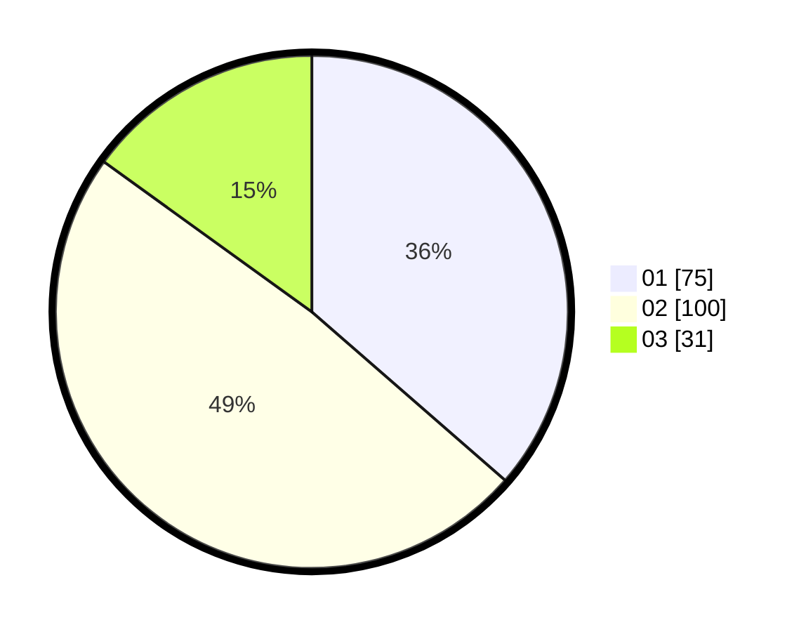

# Hasil

Hasil perolehan suara paslon dapat dilihat pada file paslon-01.txt, paslon-02.txt, dan paslon-03.txt.

Jika tidak ada, artinya data tersebut belum ada pada SIREKAP.

## Perolehan Suara

 * Paslon 01: **75**.
 * Paslon 02: **100**.
 * Paslon 03: **31**.

## Foto C Plano

https://sirekap-obj-formc.kpu.go.id/e16c/pemilu/ppwp/31/73/02/10/01/3173021001003-20240215-093504--fafff0f0-8164-40df-812a-c9ff758c77c6.jpg

https://sirekap-obj-formc.kpu.go.id/e16c/pemilu/ppwp/31/73/02/10/01/3173021001003-20240215-093513--a192e2dc-2d35-4432-b6af-c0e8a16f1031.jpg

https://sirekap-obj-formc.kpu.go.id/e16c/pemilu/ppwp/31/73/02/10/01/3173021001003-20240215-093518--8637e175-cf64-4c74-9813-9cdba29b579d.jpg

## DATA PEMILIH TETAP

Jumlah pemilih dalam DPT: **253**.
 * L: **120**.
 * P: **133**.

## DATA PENGGUNA HAK PILIH

Jumlah pengguna hak pilih dalam DPT: **203**.
 * L: **97**.
 * P: **106**.

Jumlah pengguna hak pilih dalam DPTb: **10**.
 * L: **10**.
 * P: **0**.

Jumlah pengguna hak pilih dalam DPK: **2**.
 * L: **2**.
 * P: **0**.

Jumlah pengguna hak pilih: **215**.
 * L: **109**.
 * P: **106**.

## JUMLAH SUARA SAH DAN TIDAK SAH

JUMLAH SELURUH SUARA SAH: **206**.

JUMLAH SUARA TIDAK SAH: **9**.

JUMLAH SELURUH SUARA SAH DAN SUARA TIDAK SAH: **215**.
