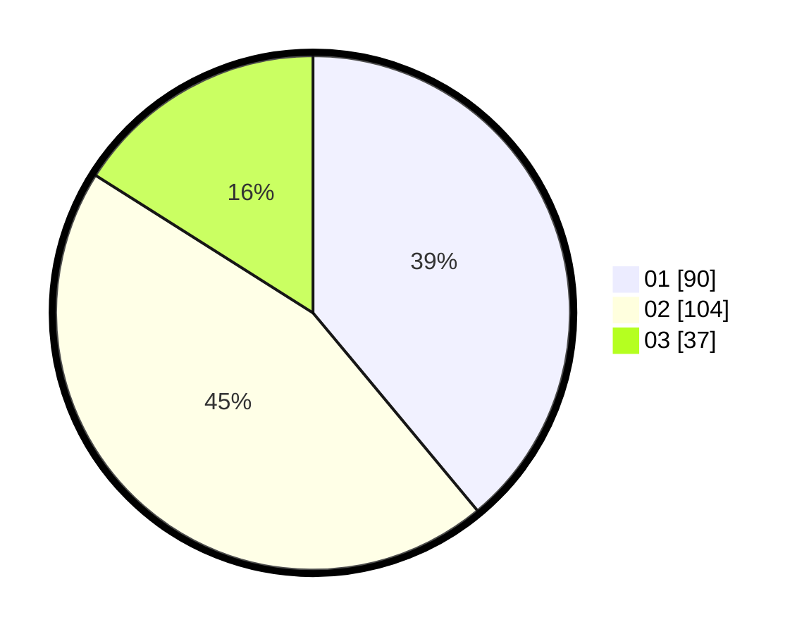

# Hasil

Hasil perolehan suara paslon dapat dilihat pada file paslon-01.txt, paslon-02.txt, dan paslon-03.txt.

Jika tidak ada, artinya data tersebut belum ada pada SIREKAP.

## Perolehan Suara

 * Paslon 01: **90**.
 * Paslon 02: **104**.
 * Paslon 03: **37**.

## Foto C Plano

https://sirekap-obj-formc.kpu.go.id/791b/pemilu/ppwp/31/73/02/10/01/3173021001005-20240214-195553--a17b52ef-4fcd-4a51-81c8-f0976a5193a6.jpg

https://sirekap-obj-formc.kpu.go.id/791b/pemilu/ppwp/31/73/02/10/01/3173021001005-20240214-195847--c9b3f746-0047-4919-8cf1-f8f5c22210aa.jpg

https://sirekap-obj-formc.kpu.go.id/791b/pemilu/ppwp/31/73/02/10/01/3173021001005-20240214-195946--1083024f-7c7e-4c7d-b2d8-f16c37fe00d7.jpg

## DATA PEMILIH TETAP

Jumlah pemilih dalam DPT: **268**.
 * L: **134**.
 * P: **134**.

## DATA PENGGUNA HAK PILIH

Jumlah pengguna hak pilih dalam DPT: **219**.
 * L: **107**.
 * P: **112**.

Jumlah pengguna hak pilih dalam DPTb: **15**.
 * L: **6**.
 * P: **9**.

Jumlah pengguna hak pilih dalam DPK: **1**.
 * L: **1**.
 * P: **0**.

Jumlah pengguna hak pilih: **235**.
 * L: **114**.
 * P: **121**.

## JUMLAH SUARA SAH DAN TIDAK SAH

JUMLAH SELURUH SUARA SAH: **231**.

JUMLAH SUARA TIDAK SAH: **4**.

JUMLAH SELURUH SUARA SAH DAN SUARA TIDAK SAH: **235**.
