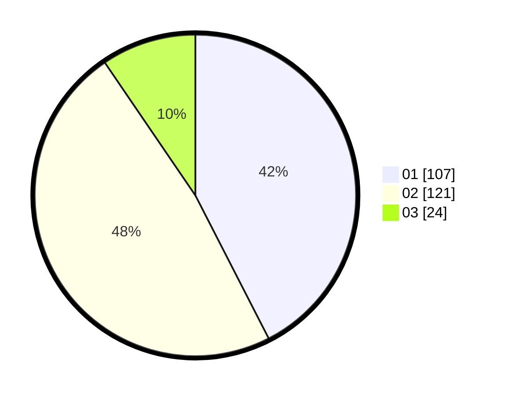

# Hasil

Hasil perolehan suara paslon dapat dilihat pada file paslon-01.txt, paslon-02.txt, dan paslon-03.txt.

Jika tidak ada, artinya data tersebut belum ada pada SIREKAP.

## Perolehan Suara

 * Paslon 01: **107**.
 * Paslon 02: **121**.
 * Paslon 03: **24**.

## Foto C Plano

https://sirekap-obj-formc.kpu.go.id/fe34/pemilu/ppwp/31/73/02/10/01/3173021001006-20240214-184657--f8c8fc89-491f-4a70-b6b3-5809d9a45676.jpg

https://sirekap-obj-formc.kpu.go.id/fe34/pemilu/ppwp/31/73/02/10/01/3173021001006-20240215-003001--f7a7af99-9513-405d-9d27-8031010cc3b8.jpg

https://sirekap-obj-formc.kpu.go.id/fe34/pemilu/ppwp/31/73/02/10/01/3173021001006-20240215-000559--3a2506a4-89b1-4425-a1a9-9fb6c7f71207.jpg

## DATA PEMILIH TETAP

Jumlah pemilih dalam DPT: **274**.
 * L: **137**.
 * P: **137**.

## DATA PENGGUNA HAK PILIH

Jumlah pengguna hak pilih dalam DPT: **232**.
 * L: **103**.
 * P: **129**.

Jumlah pengguna hak pilih dalam DPTb: **22**.
 * L: **11**.
 * P: **11**.

Jumlah pengguna hak pilih dalam DPK: **2**.
 * L: **2**.
 * P: **0**.

Jumlah pengguna hak pilih: **256**.
 * L: **116**.
 * P: **140**.

## JUMLAH SUARA SAH DAN TIDAK SAH

JUMLAH SELURUH SUARA SAH: **252**.

JUMLAH SUARA TIDAK SAH: **4**.

JUMLAH SELURUH SUARA SAH DAN SUARA TIDAK SAH: **256**.
