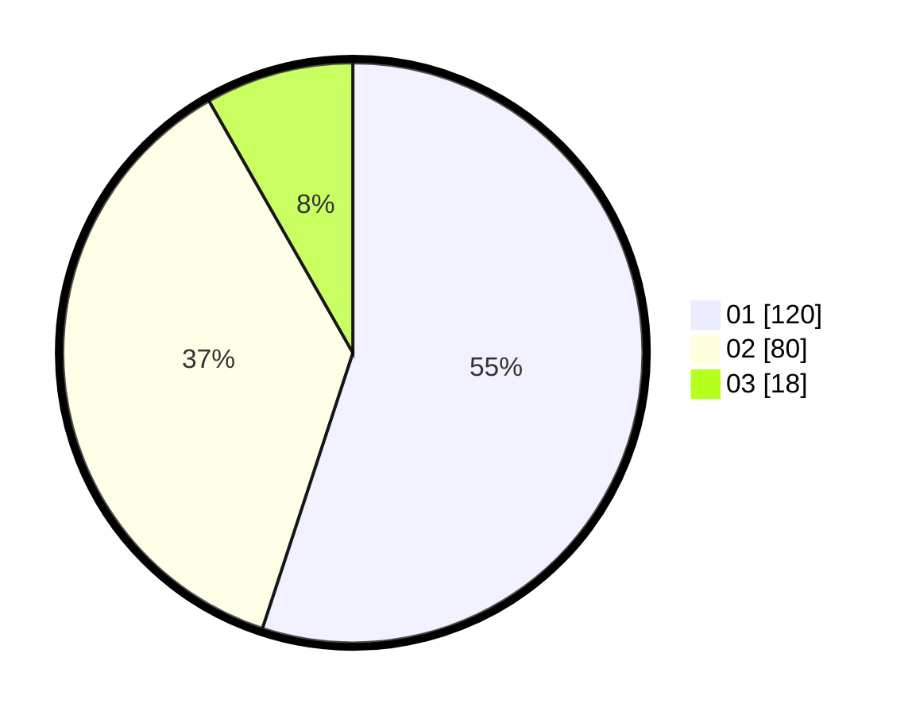

# Hasil

Hasil perolehan suara paslon dapat dilihat pada file paslon-01.txt, paslon-02.txt, dan paslon-03.txt.

Jika tidak ada, artinya data tersebut belum ada pada SIREKAP.

## Perolehan Suara

 * Paslon 01: **120**.
 * Paslon 02: **80**.
 * Paslon 03: **18**.

## Foto C Plano

https://sirekap-obj-formc.kpu.go.id/917b/pemilu/ppwp/31/73/02/10/01/3173021001008-20240214-192738--bd32eaf5-c7b3-415c-b7c8-fb33bd839b42.jpg

https://sirekap-obj-formc.kpu.go.id/917b/pemilu/ppwp/31/73/02/10/01/3173021001008-20240214-193337--30ae1c30-cb21-456e-aca0-c89f5653041a.jpg

https://sirekap-obj-formc.kpu.go.id/917b/pemilu/ppwp/31/73/02/10/01/3173021001008-20240214-192937--a561b571-2ac7-43c1-990a-ee38eff27b3f.jpg

## DATA PEMILIH TETAP

Jumlah pemilih dalam DPT: **266**.
 * L: **136**.
 * P: **130**.

## DATA PENGGUNA HAK PILIH

Jumlah pengguna hak pilih dalam DPT: **206**.
 * L: **108**.
 * P: **98**.

Jumlah pengguna hak pilih dalam DPTb: **17**.
 * L: **8**.
 * P: **9**.

Jumlah pengguna hak pilih dalam DPK: **0**.
 * L: **0**.
 * P: **0**.

Jumlah pengguna hak pilih: **223**.
 * L: **116**.
 * P: **107**.

## JUMLAH SUARA SAH DAN TIDAK SAH

JUMLAH SELURUH SUARA SAH: **218**.

JUMLAH SUARA TIDAK SAH: **5**.

JUMLAH SELURUH SUARA SAH DAN SUARA TIDAK SAH: **223**.
