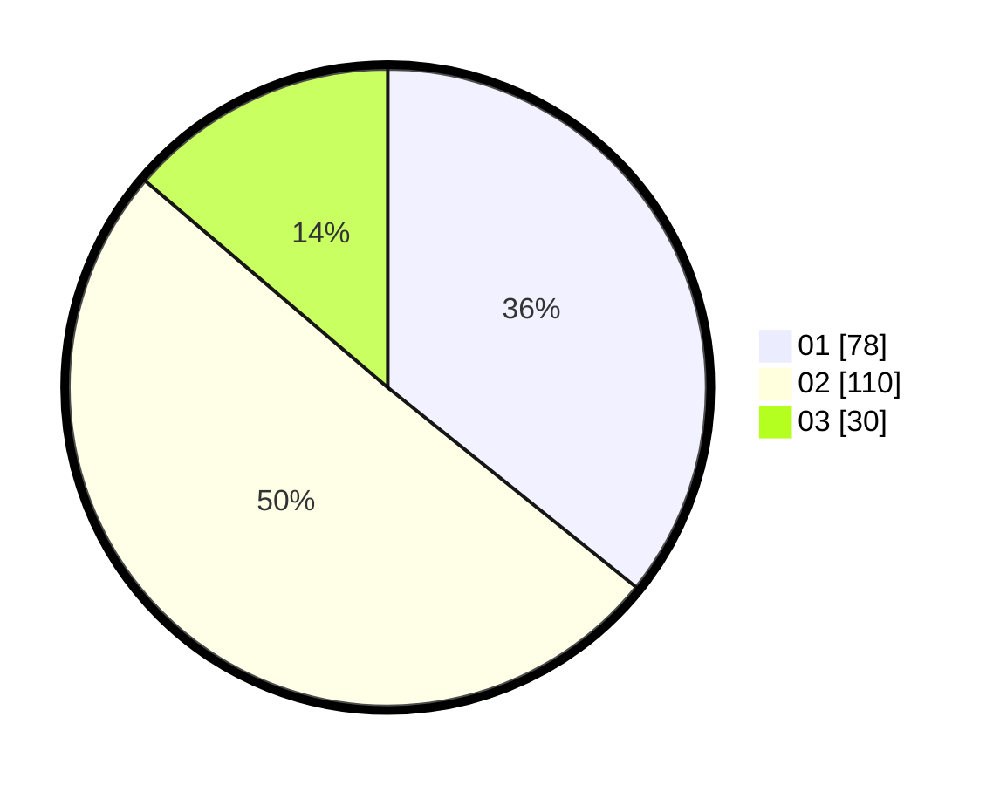

# Hasil

Hasil perolehan suara paslon dapat dilihat pada file paslon-01.txt, paslon-02.txt, dan paslon-03.txt.

Jika tidak ada, artinya data tersebut belum ada pada SIREKAP.

## Perolehan Suara

 * Paslon 01: **78**.
 * Paslon 02: **110**.
 * Paslon 03: **30**.

## Foto C Plano

https://sirekap-obj-formc.kpu.go.id/d809/pemilu/ppwp/31/73/02/10/01/3173021001011-20240217-173430--48435f47-5cb2-45f0-9e1c-543a7b6ca144.jpg

https://sirekap-obj-formc.kpu.go.id/d809/pemilu/ppwp/31/73/02/10/01/3173021001011-20240217-173457--42613224-3cd3-474a-985f-b2dfa0c11258.jpg

https://sirekap-obj-formc.kpu.go.id/d809/pemilu/ppwp/31/73/02/10/01/3173021001011-20240217-173535--17858beb-daea-4580-b387-fdd95bb50346.jpg

## DATA PEMILIH TETAP

Jumlah pemilih dalam DPT: **276**.
 * L: **146**.
 * P: **130**.

## DATA PENGGUNA HAK PILIH

Jumlah pengguna hak pilih dalam DPT: **205**.
 * L: **102**.
 * P: **103**.

Jumlah pengguna hak pilih dalam DPTb: **16**.
 * L: **8**.
 * P: **8**.

Jumlah pengguna hak pilih dalam DPK: **0**.
 * L: **0**.
 * P: **0**.

Jumlah pengguna hak pilih: **221**.
 * L: **110**.
 * P: **111**.

## JUMLAH SUARA SAH DAN TIDAK SAH

JUMLAH SELURUH SUARA SAH: **218**.

JUMLAH SUARA TIDAK SAH: **3**.

JUMLAH SELURUH SUARA SAH DAN SUARA TIDAK SAH: **221**.
