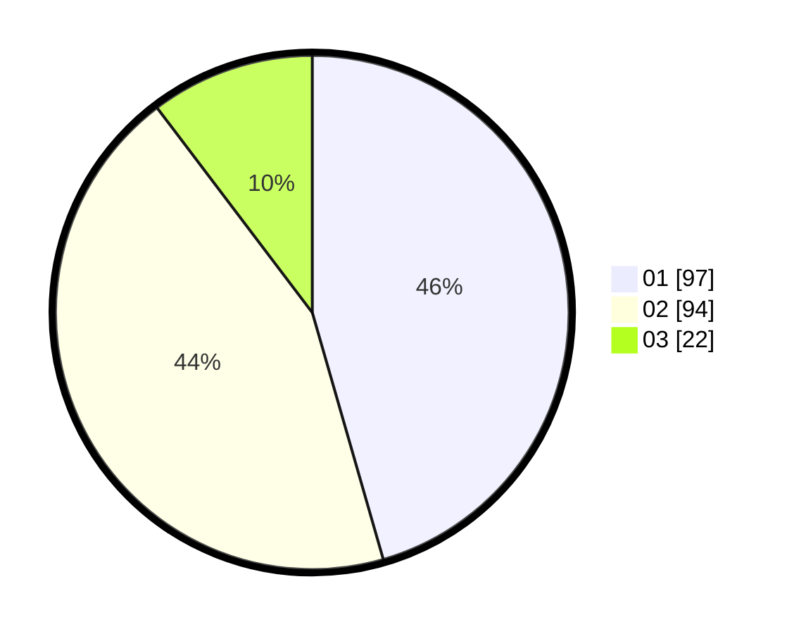

# Hasil

Hasil perolehan suara paslon dapat dilihat pada file paslon-01.txt, paslon-02.txt, dan paslon-03.txt.

Jika tidak ada, artinya data tersebut belum ada pada SIREKAP.

## Perolehan Suara

 * Paslon 01: **97**.
 * Paslon 02: **94**.
 * Paslon 03: **22**.

## Foto C Plano

https://sirekap-obj-formc.kpu.go.id/ccbb/pemilu/ppwp/31/73/02/10/01/3173021001012-20240217-175514--d5663957-9759-4ca0-a3da-e92f61925a95.jpg

https://sirekap-obj-formc.kpu.go.id/ccbb/pemilu/ppwp/31/73/02/10/01/3173021001012-20240217-175543--fe792185-27e8-467b-94a0-3b3000d97651.jpg

https://sirekap-obj-formc.kpu.go.id/ccbb/pemilu/ppwp/31/73/02/10/01/3173021001012-20240217-180212--85a71bb8-49c6-44f6-bf5c-bada40b926bd.jpg

## DATA PEMILIH TETAP

Jumlah pemilih dalam DPT: **270**.
 * L: **133**.
 * P: **137**.

## DATA PENGGUNA HAK PILIH

Jumlah pengguna hak pilih dalam DPT: **205**.
 * L: **96**.
 * P: **109**.

Jumlah pengguna hak pilih dalam DPTb: **12**.
 * L: **8**.
 * P: **4**.

Jumlah pengguna hak pilih dalam DPK: **1**.
 * L: **1**.
 * P: **0**.

Jumlah pengguna hak pilih: **218**.
 * L: **105**.
 * P: **113**.

## JUMLAH SUARA SAH DAN TIDAK SAH

JUMLAH SELURUH SUARA SAH: **213**.

JUMLAH SUARA TIDAK SAH: **5**.

JUMLAH SELURUH SUARA SAH DAN SUARA TIDAK SAH: **218**.
